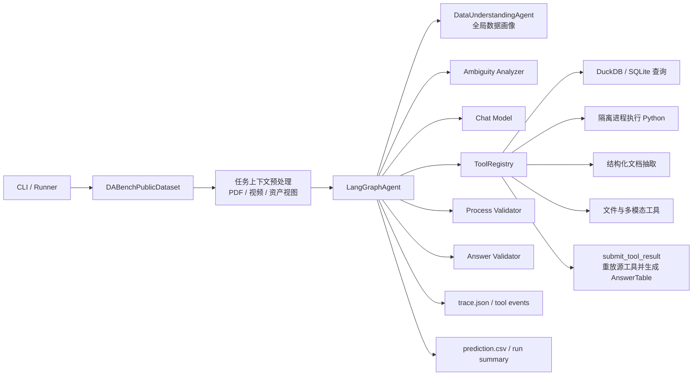
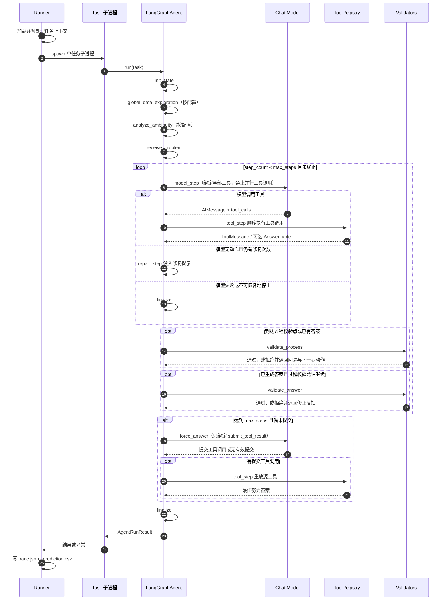
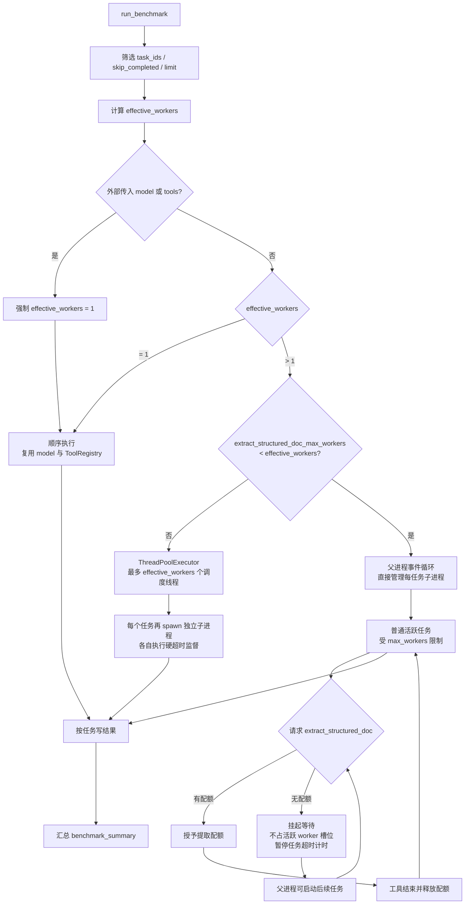
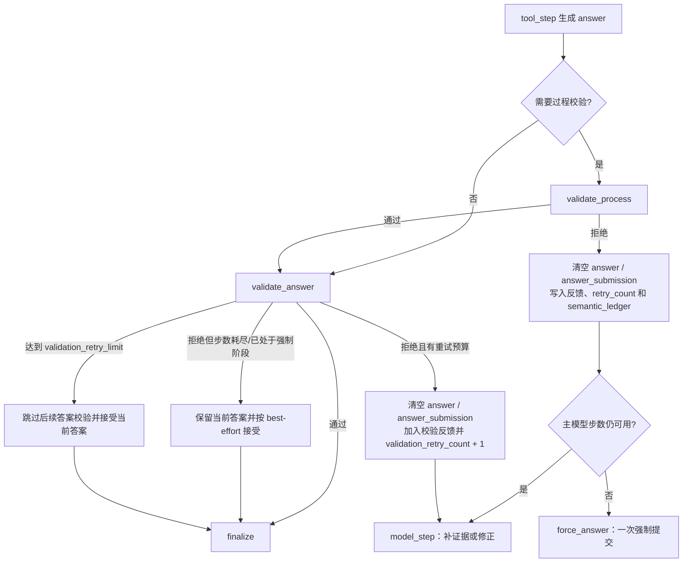

# 系统架构

本文依据当前仓库代码描述 Data Agent 的运行结构、LangGraph 状态机、批量并发及超时边界。配置项均为运行时可配置值；文末单独列出代码默认值与 `configs/docker.yaml` 的部署值。

## 1. 系统模块图



主要职责：

- `run/runner.py`：任务准备、单任务进程隔离、批量调度、超时、结果落盘。
- `agents/langgraph_runtime.py`：构建并执行 Agent 状态图。
- `agents/state.py`：定义图状态 `AgentGraphState`。
- `tools/registry.py`：注册工具，并以 `submit_tool_result` 作为唯一终止型提交工具。
- `agents/process_validator.py`：检查推理过程和证据链。
- `agents/answer_validator.py`：检查已提交答案的交付格式与答案风险。

## 2. 单任务时序图



说明：模型绑定参数为 `parallel_tool_calls=False`，因此一次模型响应即使包含多个工具调用，`tool_step` 也按列表顺序逐个执行。

## 3. 批量任务执行图



结构化文档门控的补充规则：

- 等待队列优先选择已知 `priority_chunk_count` 较小的任务，再按请求顺序和 `task_id` 排序。
- 等待配额的任务处于 `waiting` 状态，不计入活跃任务数，因此物理子进程数可以暂时大于 `max_workers`；`max_workers` 是活跃任务上限，不是严格的进程数上限。
- 所有任务都已启动后，门控允许的提取并发上限会放宽到 `effective_workers`，用于排空等待任务。

## 4. AgentGraphState 字段

`AgentGraphState` 是 `total=False` 的 `TypedDict`，字段可选。带 reducer 的列表字段在节点更新时追加，其余字段覆盖。

| 字段                                   | 类型 / 合并方式                         | 含义                                                              |
| -------------------------------------- | --------------------------------------- | ----------------------------------------------------------------- |
| `task_id`                            | `str`                                 | 当前任务标识。                                                    |
| `messages`                           | `list[BaseMessage]`，`add_messages` | 系统、用户、模型和工具消息历史。                                  |
| `step_count`                         | `int`                                 | 已完成的主`model_step` 次数；不统计工具、校验、修复和强制提交。 |
| `empty_stop_retry_count`             | `int`                                 | 模型无工具动作时已进行的修复次数。                                |
| `last_model_had_invalid_tool_calls`  | `bool`                                | 最近模型响应是否包含被丢弃的非法工具调用。                        |
| `last_invalid_tool_call_errors`      | `list[dict]`                          | 非法工具调用的结构化错误，供`repair_step` 生成定向提示。        |
| `validation_retry_count`             | `int`                                 | 答案校验拒绝次数。                                                |
| `answer_validation_history`          | `list[dict]`，列表相加                | 答案指纹、结构和历次校验结果，用于后续校验参考。                  |
| `process_validation_retry_count`     | `int`                                 | 过程校验拒绝次数。                                                |
| `last_process_validated_model_count` | `int`                                 | 上次过程校验时的`step_count`，用于周期检查。                    |
| `process_validation_passed`          | `bool`                                | 当前证据链是否已通过过程校验。                                    |
| `forced_answer_attempted`            | `bool`                                | 是否已经执行过唯一一次强制提交尝试。                              |
| `semantic_ledger`                    | `dict \| None`                         | 过程校验器维护的语义决策与证据账本。                              |
| `answer`                             | `AnswerTable \| None`                  | 当前已提交答案；被校验拒绝时清空。                                |
| `answer_submission`                  | `dict \| None`                         | 提交源工具、参数等可重放上下文。                                  |
| `failure_reason`                     | `str \| None`                          | 终止失败原因。非空时路由到`finalize`。                          |
| `steps`                              | `list[dict]`，列表相加                | 节点级执行记录，用于 trace。                                      |
| `tool_events`                        | `list[dict]`，列表相加                | 工具调用结果事件。                                                |
| `temp_workspace`                     | `str \| None`                          | 当前任务工具临时工作区路径。                                      |
| `started_at`                         | `str`                                 | UTC 启动时间。                                                    |
| `inspector`                          | `dict \| None`                         | 数据检查器结果，主要包含语义目录。                                |
| `global_data_profile`                | `str \| None`                          | 全局轻量数据画像；失败时保存错误说明。                            |
| `ambiguity_analysis`                 | `dict \| None`                         | 问题歧义分析结果。                                                |

## 5. 当前所有 LangGraph 节点

图中当前注册 11 个节点：

| 节点名                      | 职责                                                                                                   |
| --------------------------- | ------------------------------------------------------------------------------------------------------ |
| `init_state`              | 构建系统提示，初始化计数器、答案、trace 状态。                                                         |
| `global_data_exploration` | 按配置生成全局数据画像和语义目录；失败时降级记录错误，不终止任务。                                     |
| `analyze_ambiguity`       | 按配置分析问题中的实体、过滤、指标和语义歧义；失败时返回空分析。                                       |
| `receive_problem`         | 将用户问题、轻量目录、歧义分析和多模态资产组装为模型输入。                                             |
| `model_step`              | 调用绑定全部工具的主模型；处理请求重试、非法 JSON 工具参数和伪工具调用恢复；成功后`step_count + 1`。 |
| `tool_step`               | 顺序执行模型工具调用，将结果写回消息；`submit_tool_result` 成功时写入 `answer`。                   |
| `repair_step`             | 对“空停止”或非法工具调用注入修复提示，再回到主模型。                                                 |
| `validate_process`        | 检查近期步骤、证据链、提交上下文和语义账本，可在提交前周期执行，也可在提交后执行。                     |
| `validate_answer`         | 检查提交答案；通过则保留，拒绝则清空答案并把反馈送回主循环。                                           |
| `force_answer`            | 达到最大模型步数时，只绑定`submit_tool_result`，进行一次最佳努力提交。                               |
| `finalize`                | 确定最终失败原因，关闭 trace 的 partial 状态，并进入`END`。                                          |

节点记录到 trace 时使用的短名称可能不同，例如 `model_step` 记录为 `model`，`tool_step` 记录为 `tool`。

## 6. 所有条件路由

固定主链为：

```text
START → init_state → global_data_exploration → analyze_ambiguity
      → receive_problem → model_step
finalize → END
repair_step → model_step
```

条件路由如下：

| 路由函数                           | 优先条件                           | 目标                                             |
| ---------------------------------- | ---------------------------------- | ------------------------------------------------ |
| `route_after_model`              | 已有`failure_reason`             | `finalize`                                     |
|                                    | 已有答案，且启用但尚未通过过程校验 | `validate_process`                             |
|                                    | 已有答案，否则                     | `validate_answer`                              |
|                                    | 最新模型消息包含工具调用           | `tool_step`                                    |
|                                    | 已达`max_steps`，尚未强制提交    | `force_answer`                                 |
|                                    | 已达`max_steps`，且已强制提交    | `finalize`                                     |
|                                    | 无动作且修复次数未耗尽             | `repair_step`                                  |
|                                    | 其他                               | `finalize`                                     |
| `route_after_tool`               | 已失败                             | `finalize`                                     |
|                                    | 强制提交后得到答案                 | `finalize`                                     |
|                                    | 普通提交得到答案，过程校验待执行   | `validate_process`                             |
|                                    | 普通提交得到答案，否则             | `validate_answer`                              |
|                                    | 已达最大步数                       | `force_answer` 或 `finalize`                 |
|                                    | 到达过程校验周期检查点             | `validate_process`                             |
|                                    | 其他                               | `model_step`                                   |
| `route_after_process_validation` | 已失败                             | `finalize`                                     |
|                                    | 仍有答案                           | `validate_answer`；强制阶段则直接 `finalize` |
|                                    | 无答案且已达最大步数               | `force_answer` 或 `finalize`                 |
|                                    | 其他                               | `model_step`                                   |
| `route_after_validation`         | 答案被清空且未失败，仍可重试       | `model_step`                                   |
|                                    | 强制阶段或步数耗尽且无答案         | `finalize`                                     |
|                                    | 答案保留或已有失败                 | `finalize`                                     |
| `route_after_force_answer`       | 已失败                             | `finalize`                                     |
|                                    | 已有答案                           | `finalize`                                     |
|                                    | 模型产生提交工具调用               | `tool_step`                                    |
|                                    | 其他                               | `finalize`                                     |

## 7. 答案被拒绝后的回环



关键点：

- 两类拒绝都会把反馈追加为 `HumanMessage`，让下一次 `model_step` 看见问题并重新调用工具或提交。
- 过程校验拒绝会更新 `semantic_ledger`；答案校验拒绝会追加 `answer_validation_history`。
- 答案校验器异常时保留原答案（fail-open）；过程校验器异常时继续主流程（fail-open）。
- 强制提交得到的答案跳过两个校验器，直接结束，避免在无剩余模型步数时再次进入循环。

## 8. 最大步数、强制提交与失败终止

### 最大步数

- `max_steps` 仅限制 `model_step` 的成功调用次数。
- 工具执行、修复、数据画像、歧义分析、两个校验节点及 `force_answer` 不增加 `step_count`。
- 模型请求异常不会增加 `step_count`，但会设置 `failure_reason` 并终止。

### 强制提交

- 达到 `max_steps` 且没有答案时，最多进入一次 `force_answer`。
- 强制模型只看见 `submit_tool_result`，并收到立即提交最佳可用答案的提示。
- `submit_tool_result` 不复用预览结果，而是从头重放 `execute_probe_query` 或 `execute_python`，其完整输出成为最终 `AnswerTable`。
- 强制模型未调用提交工具、提交工具不可用或强制模型请求失败，均进入失败终止。

### 失败终止

`finalize` 在无答案时归一化为以下失败原因之一：

- `Agent did not submit an answer within max_steps.`
- `Model did not request a tool or submit an answer.`
- `Agent finished without submitting an answer.`

此外，模型请求失败、JSON 参数连续修复失败、强制提交失败、任务子进程异常退出或任务墙钟超时都会产生更具体的 `failure_reason`。全局数据画像和歧义分析失败属于可降级错误，不直接终止主任务。

## 9. 并发与超时边界

| 边界            | 实现与语义                                                                                                                              |
| --------------- | --------------------------------------------------------------------------------------------------------------------------------------- |
| 批量任务并发    | `run.max_workers` 控制活跃任务数。普通并行路径用线程池调度，每个任务在独立 `spawn` 子进程中运行。                                   |
| 结构化文档并发  | 当`extract_structured_doc_max_workers < max_workers` 时启用专用门控；等待门控的任务不占活跃槽位。                                     |
| 单任务墙钟超时  | `run.task_timeout_seconds > 0` 时由父进程监督；超时先 `terminate()`，等待 1 秒，仍存活则 `kill()`。`<= 0` 表示关闭。            |
| 文档抽取加时    | 任务一旦请求`extract_structured_doc`，墙钟上限增加一次 `extract_structured_doc_timeout_bonus_seconds`。门控等待时间不计入有效耗时。 |
| 模型请求超时    | 每次模型调用受`agent.model_request_timeout_seconds` 限制；`0`、负数或 `null` 可关闭。它是请求级边界，不替代任务级硬超时。         |
| Python 工具超时 | `execute_python` 在独立 `spawn` 子进程中执行，固定 30 秒；超时同样先 terminate，后 kill。                                           |
| 结果恢复        | 任务超时或子进程异常时，Runner 会尝试从实时`trace.json` 恢复已经提交的答案，同时仍记录任务失败原因。                                  |

需要特别注意的硬超时适用范围：

- `execute_task` 只有在未显式传入 `model` 和 `tools` 时才走单任务子进程硬超时；传入测试替身或共享实例时直接在当前进程执行。
- `run_benchmark` 的单 worker 分支会显式复用模型和工具，因此该分支不经过任务级子进程硬超时，只保留模型请求级和工具自身的超时。
- 普通 `run_single_task` 的上下文预处理发生在启动受监督的 Agent 子进程之前，因此该预处理时间不计入 `task_timeout_seconds`；专用结构化文档门控路径在任务子进程内预处理，且从进程启动开始计时。

## 10. 当前配置快照

| 配置                                                 |  代码默认值 | `configs/docker.yaml` |
| ---------------------------------------------------- | ----------: | ----------------------: |
| `agent.max_steps`                                  |          16 |                      64 |
| `agent.model_request_timeout_seconds`              |     1800 秒 |                 2400 秒 |
| `agent.validation_retry_limit`                     |           2 |                       2 |
| `agent.enable_answer_validator`                    |    `true` |                `true` |
| `agent.enable_process_validator`                   |   `false` |                `true` |
| `process_validator.checkpoint_model_interval`      | 10 个模型步 |             12 个模型步 |
| `process_validator.retry_limit`                    |           5 |                       1 |
| `run.max_workers`                                  |           4 |                       8 |
| `run.extract_structured_doc_max_workers`           |           2 |                       2 |
| `run.task_timeout_seconds`                         |      600 秒 |                 1200 秒 |
| `run.extract_structured_doc_timeout_bonus_seconds` |        0 秒 |                 1800 秒 |

## 11. 代码依据

- `src/data_agent_baseline/agents/state.py`：状态字段与 reducer。
- `src/data_agent_baseline/agents/langgraph_runtime.py`：节点、条件路由、校验回环、强制提交与最终终止。
- `src/data_agent_baseline/run/runner.py`：单任务子进程、批量调度、文档抽取门控、超时与结果恢复。
- `src/data_agent_baseline/tools/registry.py`：工具注册和 `submit_tool_result`。
- `src/data_agent_baseline/tools/python_exec.py`：Python 工具进程隔离及 30 秒超时。
- `src/data_agent_baseline/config.py`、`configs/docker.yaml`：默认配置与部署配置。
