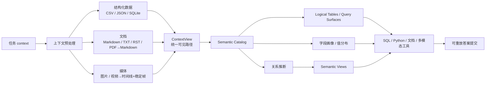
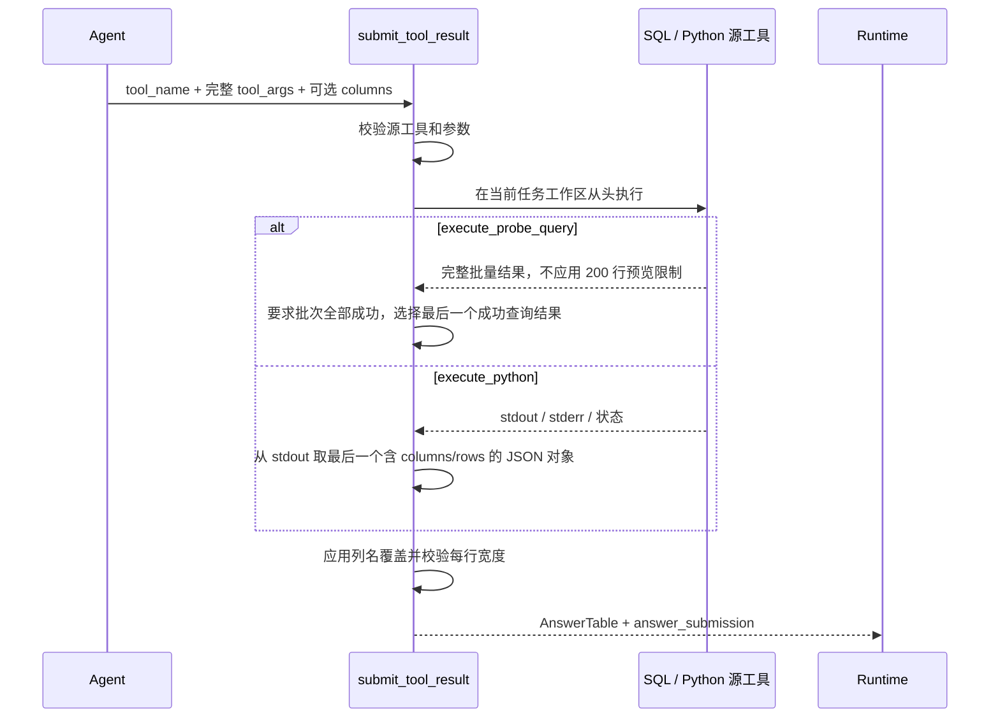
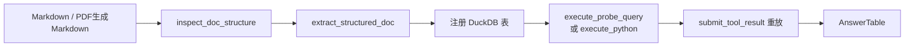

# 数据理解、工具与答案提交

本文依据当前代码说明项目区别于普通对话 Agent 的核心能力：它不是让模型直接阅读若干文件后手写答案，而是先把异构数据整理成统一的可发现、可查询、可追溯上下文，再通过受控工具生成并重放最终结果。

## 第一部分：数据理解

### 1. 统一处理链路



系统采用两层统一方式：

1. 所有原始或生成文件都映射为 `ContextAsset`，通过同一套相对路径访问。
2. 可表格化的数据进一步映射为 DuckDB 可查询的 logical table；文档和媒体则保留为可搜索、可读取、可抽取或可查看的资产。

### 2. 各类数据如何处理

| 数据类型             | 预处理与统一方式                                                                                                                                                                                          | Agent 使用方式                                                                                                     |
| -------------------- | --------------------------------------------------------------------------------------------------------------------------------------------------------------------------------------------------------- | ------------------------------------------------------------------------------------------------------------------ |
| CSV                  | 保留原文件；扫描表头和全部行，按文件名 stem 建立 logical table，并在 DuckDB 中用`read_csv_auto` 创建视图。                                                                                              | 优先使用`execute_probe_query`；复杂转换使用带 `query` / `query_rows` 的 `execute_python`。                 |
| JSON                 | 保留原文件；递归展平字段。列表、单数组对象和`records` 包装会识别其行粒度；DuckDB 查询面与 Catalog 字段保持一致。                                                                                        | 与 CSV 一样作为 logical table 查询；字段画像同时保留`name` 和必要时的 `json_path`。                            |
| SQLite               | 只读连接，扫描所有非系统表、字段、主键、外键、行数和值分布；每张表暴露为 logical table。名称冲突时使用带资产 stem 的唯一名称。                                                                            | DuckDB 将 SQLite 表注册为视图；也可由专用 distinct 工具直接只读查询。                                              |
| PDF                  | 预处理阶段用 PyMuPDF 提取文本行；若 PDF 有目录则恢复 Markdown 标题，并合并段落及可能跨页的连续文本。原 PDF 在`ContextView` 中由生成的 `.md` 资产替代。当前流程不做 OCR，纯扫描 PDF 可能无法提取正文。 | 作为普通 Markdown 文档使用`search_doc`、`read_doc`、`inspect_doc_structure` 和 `extract_structured_doc`。  |
| Markdown / TXT / RST | 原文件直接进入`ContextView`；Catalog 记录标题、token 数和受预算限制的预览。`knowledge.md` 保存完整内容。                                                                                              | 用目录、搜索和按标题读取工具定位信息；含结构化实体时可进一步抽表。                                                 |
| 图片                 | JPG/JPEG/PNG/WebP 保留为文件资产，并在轻量 Catalog 中列为`media`。                                                                                                                                      | `read_context_image` 将图片附加到下一次模型请求；重要事实随后用 `record_visual_evidence` 留下证据回执。        |
| 视频                 | 原视频不直接交给主 Agent。预处理会抽取稳定视觉片段、保存关键帧、执行语音转写，并生成 Markdown 时间线；随后可由预主流程的视频理解模型生成摘要。                                                            | 主 Agent 阅读时间线/摘要，并按需打开稳定帧、记录视觉证据。预处理失败时生成错误说明文档，而不是暴露不可消费的视频。 |

当前视频格式为 `.mp4`、`.m4v`、`.mov`、`.webm`、`.mkv`、`.avi`；图片查看工具仅支持 `.jpg`、`.jpeg`、`.png`、`.webp`。

### 3. ContextView 与生成资产

`ContextView` 不复制整个原始目录，而是给 Agent 提供一个统一的“可见文件系统”：

```text
ContextView
├── source_context_dir       原始 context 根目录
├── generated_context_dir    PDF、视频等生成资产目录
└── assets[]
    ├── visible_path         工具和模型使用的相对路径
    ├── physical_path        实际文件位置
    ├── source_path          对应的原始资产路径
    ├── action               source / pdf_to_markdown / video_timeline / ...
    └── generated            是否为生成资产
```

路径解析始终以 `visible_path` 为准，并拒绝绝对路径或包含 `..` 的越界路径。预处理结果记录在 `context_preprocessing_manifest.json`；视频还会保存稳定帧、转写、时间线和各自 manifest。

当 Python 或文档抽取需要可写环境时，`TaskContextWorkspace` 延迟创建任务级临时目录：

- 生成资产复制到临时工作区。
- 原始资产优先建立符号链接，失败时复制。
- SQL helper、Python 代码和结构化文档结果都在同一任务工作区中工作。
- 任务结束后进行 best-effort 清理，不修改原始数据。

### 4. Semantic Catalog 的结构

完整 Catalog 由 `build_semantic_catalog` 生成，核心结构如下：

| 字段                       | 内容                                                     |
| -------------------------- | -------------------------------------------------------- |
| `task_id`                | 当前任务 ID。                                            |
| `assets`                 | 每个可见资产的路径、类型、大小和推荐工具。               |
| `schemas`                | CSV、JSON、SQLite、文档的详细扫描结果。                  |
| `semantic_entities`      | 当前保留的扩展槽位，现有构建逻辑初始化为空。             |
| `field_meanings`         | 当前保留的扩展槽位，现有构建逻辑初始化为空。             |
| `relationships`          | 显式 SQLite 外键和基于字段名、类型、值重合推断出的关系。 |
| `derived_views`          | 已通过行粒度验证的 Semantic View。                       |
| `relationship_warnings`  | 关系或派生视图验证警告。                                 |
| `query_relevance`        | 问题词与资产/字段名的词元匹配结果。                      |
| `semantic_uncertainties` | 资产扫描失败等不确定性及处理提示。                       |

主模型首轮不会收到完整 Catalog，而是收到压缩后的 lightweight catalog：

- `query_surfaces`：每个基础表对应一个推荐查询面；若存在合格 Semantic View，则优先给出派生查询面。
- `documents`：非 `knowledge.md` 文档、标题和推荐工具。
- `media`：图片资产。
- `knowledge_documents`：完整 `knowledge.md` 内容。
- `semantic_uncertainties`：必须注意的数据风险。

完整字段画像、关系和文档信息通过 Catalog 工具按需获取，避免一次性挤占模型上下文。

### 5. 字段统计与值分布

Catalog 的字段画像并非只读取几行样本：

- CSV：扫描全部行，记录推断类型、缺失数、基数、Top-N 高频值以及数值最小/最大值。
- JSON：递归收集字段值；列表递归展开受每层前 20 个元素限制，因此它更适合结构发现，`missing_count` 当前为 `None`。
- SQLite：对每张表执行只读统计，记录字段声明类型、主键、基数、Top-N 值和可计算的数值范围；`missing_count` 当前为 `None`。
- DuckDB 注册完成后，Catalog 会用实际 DuckDB 列类型校正逻辑字段类型，并保留源声明类型信息。

`DataInspectorSampleBudget.catalog_top_distinct_values` 控制 Catalog 内保留多少个高频值；需要更精确或更大的分布时，使用 `get_column_distinct_values` 或 SQL 查询。

### 6. 表关系推断

关系来源分为两类：

1. SQLite 中声明的单列外键。
2. CSV、JSON、SQLite 字段之间推断出的候选关系。

推断会综合以下证据：

- 字段是否像来源键或目标键，排除行号、序列号和明显指标字段。
- 字段类型是否兼容。
- 字段名、实体名和 `id` / `key` / `code` 等词元是否匹配。
- 来源值在目标值中的行覆盖率和 distinct 覆盖率。
- 目标字段唯一性，以及是否像 one-to-one / many-to-one。
- 是否因 200,000 个 distinct 值上限而截断画像。

非显式关系至少需要 3 个非空来源值、2 个 distinct 值；行覆盖率和 distinct 覆盖率至少一个达到 0.95，最终置信度不得低于 0.80。顺序整数假键会被排除。

推断关系只是候选 join path。`get_table_relationships` 会返回置信度和证据，但主 Agent仍需用知识文档或真实查询结果验证关键连接。

### 7. Semantic View 的构建和使用条件

Semantic View 是形如 `v_<base_table>_enriched` 的派生 DuckDB 视图，用高置信度 lookup 表补充基础表字段，但不改变基础表粒度。

构建条件：

- 功能开启，且 `max_views`、`max_dimensions_per_view` 大于 0。
- 关系基数为 many-to-one；仅当配置允许时也接受 one-to-one。
- 关系置信度达到 `min_confidence`。
- 来源 distinct 匹配率达到 `min_distinct_match_ratio`。
- 目标唯一性达到 `min_target_uniqueness_ratio`。
- 维表至少存在 `min_payload_fields` 个可附加字段。
- join 字段在实际 logical table 中可解析。
- 派生 SQL 能在 DuckDB 中创建，且视图行数与基础表行数完全相同；否则丢弃并记录 warning。

维表字段选择偏好低缺失的字符串、低基数类别或低基数数值字段；排除 join key、已有同名字段、技术字段 `id` 和高基数数值字段。连接方式固定为 `LEFT JOIN`，最多附加配置数量的维表和字段。

使用规则：

- lightweight catalog 会把合格 View 作为该基础表的推荐 `query_surface`。
- View 的 `grain` 为 `same_as_base_table`，其含义来自每列的 `source_table` / `source_field`。
- View 只是查询便利层，不是 `knowledge.md` 中声明的原始表，也不会自动过滤、聚合、去重、选择最新记录或做单位转换。
- 若 distinct 匹配率低于更严格的 `strict_distinct_match_ratio`，View 可以保留，但带有 `dimension_match_below_strict_threshold` 警告。

## 第二部分：工具清单

### 1. 统一返回约定

当前 `create_default_tool_registry` 实际注册 16 个工具。普通工具统一返回：

```json
{
  "ok": true,
  "content": {}
}
```

工具输出会按 `ToolConfig.max_output_tokens` 和 `max_list_items` 截断后交给模型；最终提交会单独保留完整 `AnswerTable`，不依赖预览内容。

下表中的“最终来源”是指能否作为 `submit_tool_result.tool_name`。运行时代码只接受 `execute_probe_query` 和 `execute_python`。

### 2. 数据查询与文档抽取工具

| 工具名                         | 用途                                                                                 | 输入参数                                                                                            | 输出格式                                                                                                          | 适用场景                                                     | 失败方式                                                                                                                  | 最终来源                                                                  |
| ------------------------------ | ------------------------------------------------------------------------------------ | --------------------------------------------------------------------------------------------------- | ----------------------------------------------------------------------------------------------------------------- | ------------------------------------------------------------ | ------------------------------------------------------------------------------------------------------------------------- | ------------------------------------------------------------------------- |
| `execute_probe_query`        | 在同一个 DuckDB 连接中批量执行只读 SQL。                                             | `queries: list[str]`；`limit: int = 5`，探查最多 200 行。                                       | `content.results[]`，每项含 `ok`、`columns`、`rows`、`row_count`、`truncated`；另有 `query_count`。 | COUNT、DISTINCT、样本、过滤、连接、聚合及直接 SQL 答案。     | 仅允许`SELECT` / `WITH`；表、列或 SQL 错误记录在对应子查询。探查会继续执行其他查询，但任一失败会令顶层 `ok=false`。 | **是**。提交时忽略预览 limit，返回完整结果。                        |
| `execute_python`             | 在任务临时工作区的独立进程中执行 Python；内置`query(sql)` 和 `query_rows(sql)`。 | `code: str`。                                                                                     | `content` 含 `success`、捕获的 `output` / `stderr`，失败时含 `error` / `traceback`。                  | 多文件转换、自定义解析、迭代计算、复杂格式化和精确构造结果。 | 代码异常、工作区/文件错误或固定 30 秒超时；超时子进程会被终止。                                                           | **是**。代码须向 stdout 打印带 `columns`、`rows` 的 JSON 对象。 |
| `inspect_doc_structure`      | 发现 Markdown/TXT 文档的结构块、候选字段和主键覆盖情况，并写入缓存。                 | `path`；`knowledge_path="knowledge.md"`；可选 `target_table`；`max_model_calls=3`，上限 3。 | `content.blocks` 与 `content.structure`。                                                                     | 结构化事实散落在自然语言章节中，准备调用抽取工具时。         | 路径/知识定义错误、模型分类或修复失败、调用预算耗尽；返回`ok=false` 和错误。                                            | 否。                                                                      |
| `extract_structured_doc`     | 根据知识字段定义和结构缓存，将文档事实抽成表，合并实体记录并注册为 DuckDB 表。       | `path`；`knowledge_path`；可选 `target_table`、`fields`；`max_model_calls=20`，上限 20。  | `columns`、`rows`、`extraction` 元数据、`unit_normalized=true`。                                          | 文档实际承载领域表或实体，SQL 暂时不可见时。                 | 缺少结构缓存、字段/块无法匹配、输入过大、模型抽取/修复失败或预算耗尽。                                                    | **不能直接作为来源**；须查询注册表后间接提交。                      |
| `get_column_distinct_values` | 获取基础字段按频次排序的 distinct 值。                                               | `table`、`column`、`top_n=20`，最多 200。                                                     | `table`、`column`、`values[{value,count}]`、`value_count`。                                               | 确认字段语义、枚举值、过滤值和值分布。                       | 表/列不存在、查询错误；只支持 CSV、JSON、SQLite 基础表，不支持 View 或抽取表。                                            | 否。                                                                      |

### 3. Semantic Catalog 工具

| 工具名                      | 用途                                                               | 输入参数                                                                                           | 输出格式                                                                                   | 适用场景                                               | 失败方式                                                                                 | 最终来源 |
| --------------------------- | ------------------------------------------------------------------ | -------------------------------------------------------------------------------------------------- | ------------------------------------------------------------------------------------------ | ------------------------------------------------------ | ---------------------------------------------------------------------------------------- | -------- |
| `search_semantic_catalog` | 对完整 Catalog 做大小写不敏感的子串搜索，不是向量语义检索。        | `query`；`scope=all`，可为 tables/fields/documents/relationships/uncertainties；`limit=20`。 | `query`、`scope`、`matches[]`、`match_count`。                                     | 用表 stem、字段名或文档 token 定位候选资源。           | 无匹配时返回空列表；Catalog 扫描失败会体现在 uncertainties，非法调用参数由参数校验拒绝。 | 否。     |
| `get_table_profile`       | 返回基础 logical table 或 Semantic View 的完整画像。               | `table`。                                                                                        | 基础表返回 kind、row_count、fields；View 另含 base、grain、joins、warnings 和字段来源。    | 需要字段类型、缺失、基数、Top 值、范围或 View 来源时。 | 未知表返回`ok=false` 和候选建议；文档 stem 不能作为表画像。                            | 否。     |
| `get_field_profile`       | 返回单个字段的完整画像。                                           | `table`、`column`。                                                                            | `table` 与 `field` 对象。                                                              | 精确核对一个字段的类型、缺失、基数、Top 值和数值范围。 | 表未知或字段名/JSON path 不匹配时`ok=false`。                                          | 否。     |
| `get_table_relationships` | 返回某表参与的显式或推断关系；View 还返回内嵌 joins 和基础表关系。 | `table`。                                                                                        | `relationships[]`，含两端字段、类型、基数、置信度和 evidence；View 返回 embedded joins。 | 发现候选 join path 并检查连接证据。                    | 未知表返回`ok=false` 和建议；无关系时成功返回空列表。                                  | 否。     |

### 4. 文件、文档与视觉工具

| 工具名                     | 用途                                                         | 输入参数                                                                                  | 输出格式                                                                       | 适用场景                                             | 失败方式                                                                         | 最终来源 |
| -------------------------- | ------------------------------------------------------------ | ----------------------------------------------------------------------------------------- | ------------------------------------------------------------------------------ | ---------------------------------------------------- | -------------------------------------------------------------------------------- | -------- |
| `list_context`           | 列出统一 ContextView 中的文件和目录元数据。                  | `max_depth=4`。                                                                         | `root`、路径约定和 `entries[{path,kind,size}]`。                           | 路径未知、寻找可用资产；不读取文件内容。             | 目录遍历或参数错误；深度不足只会隐藏更深层条目。                                 | 否。     |
| `lookup_doc_outline`     | 从 Catalog 获取文本文件的 Markdown 标题结构。                | `path`。                                                                                | `path`、`head_count`、`headings[{level,text}]`。                         | 先定位章节，再定向读取长文档。                       | 路径不存在或资产不是`.md/.txt/.rst` 时 `ok=false`。                          | 否。     |
| `search_doc`             | 对`.md/.txt/.rst` 执行正则或关键词搜索并分页返回上下文行。 | `query`；`context_lines=5`；可选 `path`；`page=1`；`page_size=20`，0 表示全部。 | `total_matches`、页信息、`results[{file,matches[]}]`；匹配含行号和前后文。 | 不知道文档或章节位置时先搜索。                       | 非法正则、指定文件不存在或读取异常会抛错并由`tool_step` 转成失败结果。         | 否。     |
| `read_doc`               | 读取完整文本或指定 Markdown 标题范围。                       | `path`；可选 `heading`。                                                              | `path`、`preview`；章节读取另含 `section` / `matched_heading`。        | 已知文档和目标章节时读取原文。                       | 文件不存在会失败；标题不存在时内容中返回`error` 和 `available_headings`。    | 否。     |
| `read_context_image`     | 将 ContextView 中的图片作为多模态内容附加到下一次模型请求。  | `path`；`detail=auto`，可为 low/high。                                                | 文本结果含路径、MIME、大小和状态；另产生 base64`image_url` 附件。            | 查看图片或视频稳定帧中的视觉事实。                   | 路径不存在、越界或扩展名不是 JPG/JPEG/PNG/WebP 时失败。                          | 否。     |
| `record_visual_evidence` | 为已打开的图片记录简洁、可供校验器使用的视觉证据回执。       | `path`、`observations`。                                                              | 路径、截断后的 observation 和状态。                                            | 视觉事实会影响答案，需要证明模型确实查看过对应帧时。 | 同一路径未先成功调用`read_context_image`，或 observation 为空时 `ok=false`。 | 否。     |

### 5. 终止工具

| 工具名                 | 用途                                                            | 输入参数                                                    | 输出格式                                                                                                       | 适用场景                                                  | 失败方式                                                                               | 最终来源                                         |
| ---------------------- | --------------------------------------------------------------- | ----------------------------------------------------------- | -------------------------------------------------------------------------------------------------------------- | --------------------------------------------------------- | -------------------------------------------------------------------------------------- | ------------------------------------------------ |
| `submit_tool_result` | 从头重放受支持的源工具，将其完整输出转换为最终`AnswerTable`。 | `tool_name`、`tool_args`、可选 `columns: list[str]`。 | 模型可见内容含`status=submitted`、源工具、列数、行数；运行时另保存完整 `answer` 和 `answer_submission`。 | 最终答案已经能由一条自包含 SQL 或 Python 程序稳定复现时。 | 不支持的源工具、`tool_args` 类型错误、源执行失败、输出不可解析、列数不符或行宽不符。 | 它是**终止提交工具**，不是被重放的源工具。 |

## 第三部分：答案提交

### 1. 为什么 `submit_tool_result` 是终止型工具

`submit_tool_result` 返回的 `ToolExecutionResult` 同时具有：

- `is_terminal=True`
- 非空 `answer: AnswerTable`
- 可追溯的 `answer_submission`

`tool_step` 发现非空 `answer` 后写入 `AgentGraphState.answer`，LangGraph 随即进入过程校验、答案校验或最终结束，而不是把普通模型文本当作答案。

这使“分析过程”和“被评分结果”严格分离：普通工具输出只用于观察；只有经过提交工具重放和结构校验的数据才能进入 `prediction.csv`。

### 2. 源 SQL / Python 如何重新执行



重放而不是复用旧输出有三个作用：

- 保证提交参数自包含，trace 可以解释答案是怎样产生的。
- SQL 提交不受探查阶段的 200 行预览限制，避免只提交样本。
- 防止模型依据被截断、过期或手工改写的观察结果提交答案。

对于 SQL 批次，虽然提取器选择最后一个成功查询作为答案，但提交前要求整个批次的顶层 `ok=true`，因此任何辅助查询失败都会导致本次提交失败。最终提交应使用干净、已验证的最小查询批次。

### 3. `columns` 如何选择

列名按以下规则确定：

1. 未提供 `submit_tool_result.columns`：使用源工具输出列名。
2. 提供 `columns`：必须是真实的字符串列表，且数量与源输出列数完全一致。
3. `columns` 只做同位置重命名，不能选择、删除或重新排列源列；这些操作必须在 SQL `SELECT` 或 Python 输出中完成。
4. 每一行的单元格数量必须与最终列数一致。
5. 只提交问题直接要求的列；稳定标识列只有在题目要求或保持记录粒度确有必要时才保留。

禁止把列表序列化成字符串，例如 `"[\"name\", \"score\"]"`；正确形式是 `columns: ["name", "score"]`，即真实 JSON 数组。

### 4. 如何构造 AnswerTable

最终结构固定为：

```json
{
  "columns": ["column_a", "column_b"],
  "rows": [
    ["value_a1", "value_b1"],
    ["value_a2", "value_b2"]
  ]
}
```

SQL 来源直接使用查询返回的 `columns` 和二维 `rows`。Python 来源必须打印机器可读 JSON，例如：

```python
import json

result = query("SELECT name, score FROM students ORDER BY name")
print(json.dumps(result, ensure_ascii=False))
```

提交器会校验 `columns`、`rows` 为列表，并要求每个 row 是 list/tuple 且宽度正确，随后构造：

```python
AnswerTable(columns=columns, rows=rows)
```

同时保存源工具、源参数、源列名、最终列名和 SQL 批次中被选中的查询索引，供 trace 和校验器使用。

### 5. 为什么不允许模型直接手写最终答案

模型的自然语言响应不会写入 `AgentGraphState.answer`。如果模型既不调用工具也不提交，图只会尝试修复，最终以“未请求工具或未提交答案”失败。

这一限制解决了普通 Agent 常见的几个问题：

- 手写表格可能漏掉预览范围之外的行。
- 自然语言或 Markdown 表格难以稳定解析和评分。
- 模型可能改变原始大小写、日期格式、空值或数值精度。
- 无法证明答案来自哪条 SQL、哪段转换代码或哪个数据版本。
- 校验失败后无法可靠重放同一生产过程。

### 6. 文档抽取结果何时能成为答案来源

`extract_structured_doc` 当前**不能**直接作为 `submit_tool_result.tool_name`。虽然参数模型的说明中仍残留直接提交抽取工具的旧文字，运行时 `_ANSWER_EXTRACTORS` 只注册：

```text
execute_probe_query
execute_python
```

文档抽取结果只有满足以下条件时才能间接成为最终答案：

1. 先用 `inspect_doc_structure` 为同一文档、目标表和任务工作区建立可匹配的结构缓存。
2. `extract_structured_doc` 成功抽取所需字段，并在当前工作区注册返回的 `extraction.registered_table`。
3. 使用 `execute_probe_query` 或 `execute_python` 查询该注册表，完成过滤、连接、排序、聚合或格式化。
4. 用同一条自包含 SQL 或 Python 代码作为 `submit_tool_result` 的源参数重新执行。



抽取工具已把货币转换为元、百分比转换为小数等数值统一到基础单位；后续查询不得依据 `knowledge.md` 再重复换算。即使抽取输出看起来已经是最终表，也必须经过注册表查询和受支持的提交源，才能成为正式答案。

## 代码依据

- `src/data_agent_baseline/run/context_preprocessor.py`、`video_preprocessor.py`、`video_understanding_agent.py`
- `src/data_agent_baseline/benchmark/schema.py`、`context_view.py`
- `src/data_agent_baseline/inspectors/semantic_catalog.py`、`semantic_views.py`
- `src/data_agent_baseline/tools/duckdb_schema.py`、`probe_engine.py`、`python_exec.py`
- `src/data_agent_baseline/tools/langgraph_tools.py`、`registry.py`
- `src/data_agent_baseline/agents/langgraph_runtime.py`
