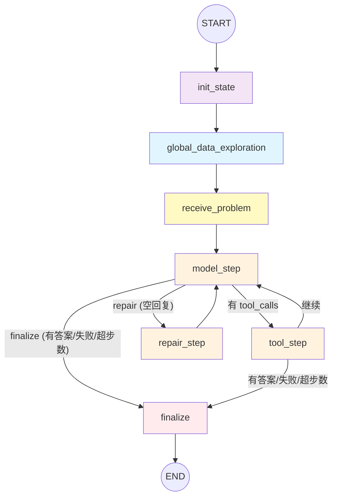

# 数据探查架构

## 概述

新架构将数据探查拆分为**两个阶段**：

1. **全局数据探索（global_data_exploration）**：在还不知道问题的情况下，全面探索所有数据资产，生成一份 **GlobalDataProfile** 或 raw catalog JSON
2. **问题注入（receive_problem）**：引入用户问题，同时将数据画像注入给主 Agent

Agent 收到 system prompt + 问题 + catalog 后，直接使用 `execute_python` / `execute_context_sql` 等工具求解。

---

## 整体节点图



**图例**：
- 蓝色：全局数据探索
- 黄色：问题注入 + catalog 注入
- 紫色：状态初始化
- 橙色：主 Agent 推理/工具/修复循环
- 红色：终结

---

## 详细节点说明

### 0. AgentGraphState（全局状态）

| 字段 | 类型 | 说明 |
|------|------|------|
| `task_id` | `str` | 任务 ID |
| `messages` | `list[BaseMessage]` | LangChain 消息列表，跨节点累加 |
| `step_count` | `int` | 主 Agent 已执行的步数 |
| `answer` | `AnswerTable \| None` | 最终提交的答案表 |
| `failure_reason` | `str \| None` | 失败原因 |
| `steps` | `list[dict]` | 执行步骤记录（trace 用） |
| `tool_events` | `list[dict]` | 工具调用事件记录 |
| `inspector` | `dict \| None` | 数据探查结果 |
| `global_data_profile` | `str \| None` | **全局数据画像（catalog JSON 或 markdown profile）** |

---

### 1. init_state — 状态初始化

**功能**：初始化 LangGraph 状态，添加 SystemMessage

**提示词**：`build_system_prompt()` / `build_system_prompt_v2()` 返回 SYSTEM_PROMPT
- 定义 Agent 的身份（工具型数据分析智能体）
- Catalog-driven strategy：解析 catalog JSON，识别文件/字段/连接/过滤条件
- 工具选择规则：不调用 list_context/read_csv/read_json/read_doc，直接用 execute_python
- 答案提交规范（columns/rows 格式）

---

### 2. global_data_exploration — 全局数据探索

**功能**：在不看问题的情况下，全面探索所有数据资产

**内部流程**：

1. 创建 `DataUnderstandingAgent`，调用 `explore_data_globally(context_dir, task_id)`
2. 内部调用 `build_semantic_catalog()` 扫描所有资产：
   - CSV / JSON / SQLite / 文档文件
   - 每个文件的 schema、字段名、cardinality、top-50 distinct values、min/max
   - `semantic_uncertainties`：无法解析的文件
3. 提取 knowledge 文档内容
4. 返回 raw catalog JSON（包含 assets/schemas/documents/uncertainties）

**输出到 State**：
```python
{
    "global_data_profile": "<markdown 文本或 raw JSON>",
}
```

---

### 3. receive_problem — 问题注入 + catalog 注入

**功能**：将用户问题作为 `HumanMessage` 注入，同时将 `global_data_profile` 作为第二条 `HumanMessage` 注入

此时 state.messages 的完整序列为：
```
[SystemMessage(系统提示), HumanMessage(问题), HumanMessage(catalog JSON 或 markdown profile)]
```

---

### 4. model_step — 主 Agent 推理

**功能**：调用 LLM 推理下一步行动

LLM 收到的完整消息上下文：
```
[SystemMessage(系统提示)]
[HumanMessage(问题)]
[HumanMessage(catalog)]                    ← receive_problem 注入
[AIMessage(tool_calls=[...])]              ← 之前的工具调用
[ToolMessage(content=..., name=...)]       ← 工具执行结果
```

LLM 可能返回：
- `AIMessage(tool_calls=[...])` → 调用工具（execute_python、answer 等）
- `AIMessage(content="working note")` → 工作笔记（需继续）
- `AIMessage(content="")` + 空 tool_calls → 空回复（需修复）

---

### 5. tool_step — 工具执行

主 Agent 可用的工具包括：
- `execute_python`：执行 Python 代码（过滤/连接/聚合）
- `execute_context_sql`：执行 SQL 查询（单 SQLite 数据库任务）
- `list_context` / `read_csv` / `read_json` / `read_doc`：读取文件（不推荐，catalog 已提供足够信息）
- `inspect_sqlite_schema`：查看 SQLite schema
- `answer`：提交最终答案

---

### 6. repair_step — 空回复修复

**触发条件**：LLM 返回了空回复（`_is_empty_stop`），且未超过 `empty_stop_retry_limit`

---

### 7. finalize — 最终化

**功能**：检查 Agent 是否在未提交答案的情况下退出，并设置相应的失败原因

---

## 路由逻辑

### 在 model_step 之后 (`route_after_model`)
- 有 failure_reason 或 answer → finalize
- 有 tool_calls → tool_step
- 空回复且 retry < limit → repair_step
- 以上都不满足 → finalize

### 在 tool_step 之后 (`route_after_tool`)
- 有 answer 或 failure_reason → finalize
- step_count >= max_steps → finalize
- 继续 → model_step

---

## 配置控制

### DataInspectorConfig

```python
class DataInspectorConfig:
    sample_budget: DataInspectorSampleBudget      # 数据采样参数
```

### LangGraphAgentConfig

```python
class LangGraphAgentConfig:
    enable_data_inspector: bool = False  # 总开关：是否启用数据探查
    max_steps: int = 16                  # 主 Agent 最大推理步数
    empty_stop_retry_limit: int = 2      # 空回复修复重试上限
    data_inspector: DataInspectorConfig  # 数据探查子配置
    prompt_version: int = 1              # 系统提示词版本
```

当 `enable_data_inspector=False` 时，`global_data_exploration` 节点返回空 `{}`，流程退化为：

```
START → init_state → [global_data_exploration(跳过)] → receive_problem → model_step → ...
```

即：系统提示 + 问题 → 直接交给主 Agent 求解，无数据探查辅助。
