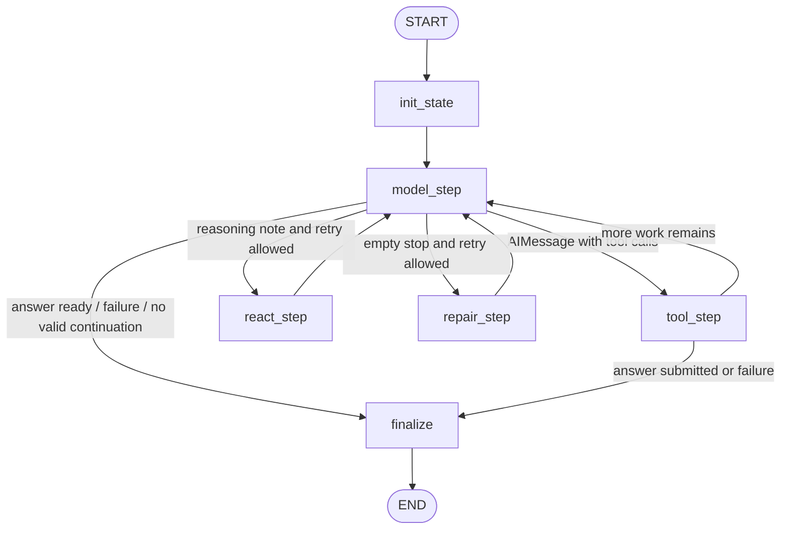
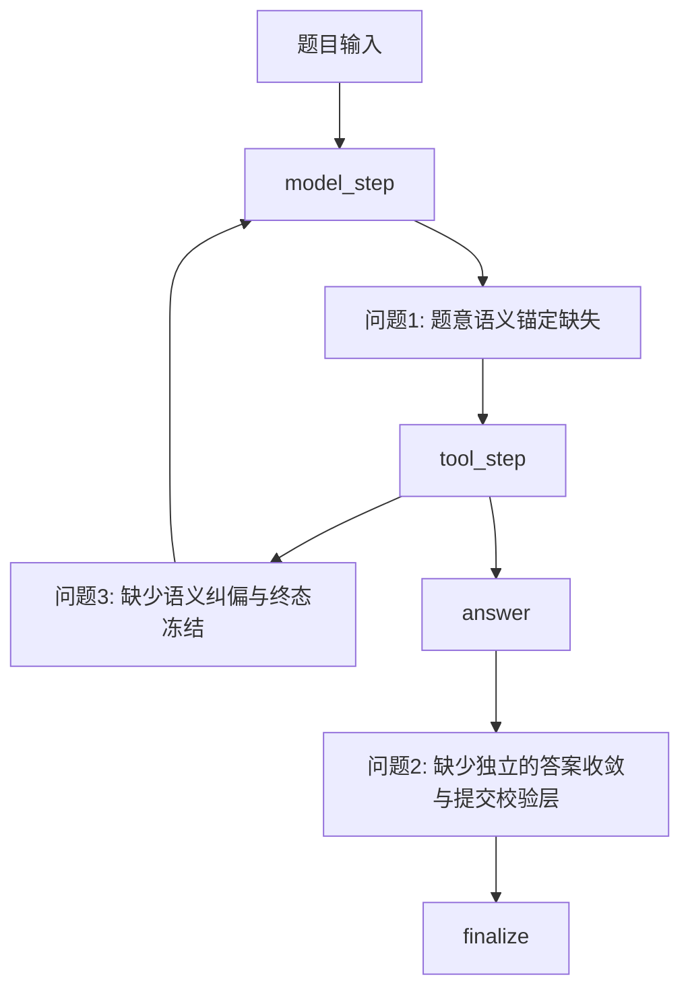

# LangGraph 当前架构与核心问题总结

这份总结基于现有两份分析文档整理而成：一份解释当前 LangGraph 基线的实际运行结构，另一份归纳当前最关键的 Top3 问题。这里不展开修复方案，重点是**快速看清当前结构**与**准确抓住主要问题**。

---

## 1. 当前结构：简要介绍

当前系统的实际运行链路可以概括为：

`runner -> LangGraphAgent -> model/tool loop -> answer -> finalize -> trace/prediction`

它本质上是一个**单主循环**的 LangGraph Agent：

- `runner` 负责加载任务、初始化模型与工具注册表
- `LangGraphAgent` 用 `StateGraph` 构建运行图
- `model_step` 负责让模型决定“继续思考 / 调工具 / 提交答案”
- `tool_step` 负责执行工具，并把结果写回消息流和状态
- `answer` 不是独立节点，而是一个终止型工具
- 最后由 `finalize` 收束状态，`runner` 落盘 `trace.json` 和 `prediction.csv`

### 当前结构的几个关键特点

1. **图结构简单**

   - 主要是 `init -> model -> tool -> model ... -> finalize`
   - 路径清晰，便于阅读和调试
2. **状态以消息流为核心**

   - `messages` 是模型和工具循环的上下文载体
   - `step_count`、retry 计数器负责控制循环
   - `answer` / `failure_reason` 决定是否终止
3. **恢复机制很轻**

   - `react_step`：模型只写了简短 note，但没行动时，提示继续
   - `repair_step`：模型空 stop 时，提示继续
   - 它们都不是严格意义上的语义纠偏机制
4. **工具体系统一，但提交层很薄**

   - 工具统一由 registry 管理
   - `answer` 工具一旦被调用成功，图就会直接走向终态
   - 没有独立的“提交前校验节点”
5. **可追踪，但不可恢复**

   - 当前有 `trace.json` 做事后审计
   - 但没有 LangGraph 原生 checkpointer
   - 也就是说：**能回看，不能从中断处继续跑**

---

## 2. 当前运行图（保留流程图）

### 如何理解这张图

这张图反映的是当前仓库中**已经实现的实际运行方式**，重点可以概括成三句话：

- **`model_step` 是分流中心**：决定去工具、继续重试，还是结束
- **`tool_step` 是执行中心**：负责把模型的工具决策真正落地
- **`finalize` 是唯一终点**：无论是成功提交还是失败结束，最后都从这里收束

所以从结构上看，当前系统是一个**串行、单通道、以模型为主导的循环式 Agent**。

---

## 3. 当前最关键的 Top3 问题

下面这三个问题不是彼此独立的，它们分别对应当前运行图在**前段理解、后段提交、中段纠偏**三个位置上的系统性薄弱点。

---

## 4. 问题 1：题意语义锚定缺失

### 问题本质

这是当前最重要的问题。

模型经常会把题目中的自然语言要求，直接映射成一个“差不多”的字段、条件或参数。这个替代在表面上往往说得通，所以不容易立刻暴露，但会让整条执行链从一开始就跑偏。

它不是“最后一步算错”，而是**题目在进入执行阶段时就被曲解了**。

### 实际运行中的犯错实例

- **`task_180`**

  - 题目要求：`more than 29.00 per unit`
  - 模型执行成：`Price > 29.00`
  - 但正确语义应是：`Price / Amount > 29.00`
  - 也就是把“单价约束”曲解成了“总价约束”
- **`task_89`**

  - 题目要求：`the driver who ranked second`
  - 模型执行成：`position = 2`
  - 正确落点应是：`rank = 2`
  - 这类错误非常典型：表面看起来接近，实际上语义已经换了
- **`task_80`**

  - 模型已经找到了正确候选 `driverId`
  - 但最终取值用了：`qualifying.number`
  - 正确来源应是：`drivers.number`
  - 说明它并不一定是“不会找人”，而是“最后取错字段来源”
- **`task_163`**

  - 模型算对了总额 `175.39`
  - 但把题目里的 `type` 误答成预算层的 `category`
  - 正确应该是事件层的 `type=Meeting`
  - 说明即使中间计算没错，字段层级一旦答错，最终答案仍会偏题

### 为什么影响最大

因为它会从源头污染后续所有步骤：

- 工具可以正常执行
- SQL / Python 可以跑通
- 中间结果甚至看起来还很合理

但最终答案仍然是“结构化地错”。

这类错误比程序报错更危险，因为它往往**不是失败得很明显，而是错得很顺利**。

---

## 5. 问题 2：缺少独立的答案收敛与提交校验层

### 问题本质

当前系统里，`answer` 是终止工具，但不是独立的提交校验层。
这意味着模型很容易把还没完全收敛的中间结果，直接当成最终答案提交出去。

典型表现包括：

- 单值题交成多行
- 题目只要一列，却多交辅助列
- 还停留在候选集或明细表，就直接提交
- 已经很接近正确，但最终表结构、粒度、行列数不对

### 实际运行中的犯错实例

- **`task_25`**

  - 这是典型的“单值题交成多行”
  - 模型已经意识到自己拿到了 12 个并列最小值
  - 但仍然直接把并列集合提交成最终答案
- **`task_80`**

  - 模型提交的不只是错误号码，还多交了 `driverId`
  - 也就是说，它不仅答错了值，还没有完成“只保留题目要求列”的收敛
- **`task_163`**

  - 模型其实算出了正确总额 `175.39`
  - 但最后把事件层 `type` 错换成预算层 `category`
  - 结果从应该的一行答案，变成了两行明细式输出
- **`task_379`**

  - 题目要求对第 4 原子的元素做 `tally`
  - 模型却停在“每分子一行”的明细表上
  - 没完成最后的聚合与去重收敛，就直接提交

### 为什么它在比赛里会直接伤分

比赛评分不只看“有没有覆盖 gold”，还会惩罚冗余输出。

所以：

- 多交一列，不只是“不够优雅”
- 它会变成 `Extra Columns`
- `Extra Columns` 会进入惩罚项

也就是说，有些答案主值可能已经对了，但因为多交了辅助列，最终仍然会被扣分。

### 为什么问题很大

很多任务不是不会做，而是**不会交卷**：

- 前面已经检索了很多信息
- 中间分析也接近正确
- 但最后没有收敛成“真正可提交的答案表”

这类错误很亏，因为它发生在流程末端，意味着前面的分析成本没有转化成有效得分。

---

## 6. 问题 3：缺少语义纠偏与终态冻结机制

### 问题本质

一旦任务进入复杂中段，当前系统容易出现两种失控：

1. **出错后只修执行形式，不重审语义假设**
2. 已经拿到关键证据后，仍然不断继续试探，直到超步

也就是说，系统缺少一种明确机制来判断：

- 当前路径是不是已经不成立
- 当前证据是不是已经足够
- 现在应该继续探索，还是应该停下来提交

### 实际运行中的犯错实例

- **`task_173`**

  - 模型已经掌握了两个关键事实：
    - `yearmonth.csv` 中存在 `201306`
    - `gasstations.json` 的国家域是 `CZE` / `SVK`
  - 但它仍然反复尝试补一条并不存在的“201306 -> GasStationID -> Country”明细级闭合链路
  - 最后在 `64` step 内没有提交答案
- **`task_352`**

  - 模型一度已经逼近正确的 `event_id` 和目标预算条目
  - 但后来把“大窗口内共同出现”误当成真实关联
  - 随后继续扩大搜索范围，最终耗尽 `max_steps`
- **`task_396`**

  - 模型已经分别抽取出：
    - 身高相关信息
    - publisher 映射
    - 角色候选集合
  - 但始终停留在“还想再补一点解析”的状态
  - 最后没有完成最终 join 和比例计算，也没有提交答案
- **`task_249`**

  - 这道题没有超步，但很能说明“只修执行、不修语义”的问题
  - 第一次 Python 因 `NoneType` 报错后，第二次确实让程序跑通了
  - 但方法是把两个指标都绑到 `UpVotes` 和 `Age` 同时非空的交集样本上
  - 程序成功了，语义却更偏了

### 典型后果

这会带来两类直接损失：

1. **超步未提交**

   - 复杂题在长链路里反复试探，最后耗尽 `max_steps`
2. **看似恢复，实则继续偏**

   - 第一次脚本报错后，第二次只是把程序跑通
   - 但语义假设并没有被修正，结果只是“换一种方式继续错”

### 为什么它重要

这个问题主要伤：

- 复杂任务覆盖率
- 多源数据任务效率
- 半结构化任务的收敛能力

它解释了很多“不是算不出来，而是一直不肯停”“不是没恢复，而是恢复后继续错”的失败现象。

---

## 7. 为什么只重点看这 3 个问题

因为它们已经覆盖了当前 LangGraph 基线最核心的三段失控：

- **前段失控**：题意被曲解
- **中段失控**：不会真正纠偏，也不会及时冻结
- **后段失控**：答案没有收敛成可提交结果

换句话说，这三个问题已经能解释当前很多失败任务的主要模式。

---

## 8. 一句话结论

当前 LangGraph 基线的优势是：**结构清晰、工具统一、过程可追踪、便于调试**。
但它最核心的系统性短板也很明确：

- **前面没有题意语义锚定**
- **中间没有真正的纠偏与冻结**
- **后面没有独立的提交校验层**

因此，当前问题并不只是“某一步答错了”，而是运行图在**理解、收敛、终态控制**三个关键位置都还缺少足够强的结构约束。
