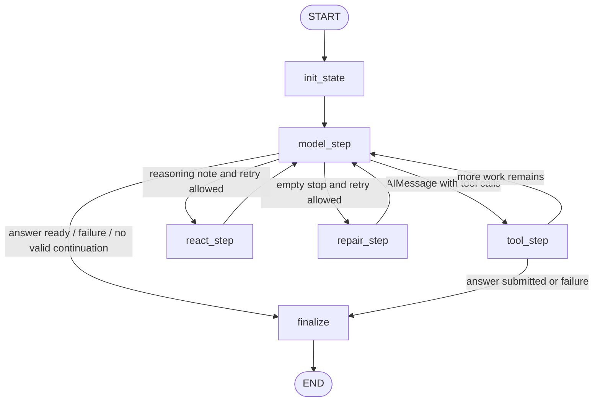

# 当前 LangGraph 架构设计

本文只解释当前仓库中的 LangGraph 运行时是如何工作的，不讨论修复方案。分析基于以下实现：

- [`src/data_agent_baseline/agents/state.py`](../../src/data_agent_baseline/agents/state.py)
- [`src/data_agent_baseline/agents/langgraph_runtime.py`](../../src/data_agent_baseline/agents/langgraph_runtime.py)
- [`src/data_agent_baseline/tools/registry.py`](../../src/data_agent_baseline/tools/registry.py)
- [`src/data_agent_baseline/agents/prompt.py`](../../src/data_agent_baseline/agents/prompt.py)
- [`src/data_agent_baseline/run/runner.py`](../../src/data_agent_baseline/run/runner.py)

## 1. 整体运行链路

当前系统的端到端链路可以概括为：

`runner -> LangGraphAgent -> model/tool loop -> answer -> trace/prediction`

更具体地说：

1. `runner` 加载任务、创建模型、构造工具注册表。
2. `LangGraphAgent` 用 `StateGraph(AgentGraphState)` 构建运行图。
3. 图从 `init_state` 开始，进入 `model_step`。
4. 模型返回：
   - 工具调用，则进入 `tool_step`
   - 简短 reasoning note，则进入 `react_step`
   - 空 stop，则进入 `repair_step`
   - 其他终止情况，则进入 `finalize`
5. 当工具层收到 `submit_tool_result` 提交的结果后，状态中写入 `answer`，然后收束到 `finalize`。
6. 整个任务完成后，由 `runner` 把运行结果写成 `trace.json`；若有答案，再额外写出 `prediction.csv`。

下面这张图描述的是“当前已经实现的实际运行图”，不是理想化流程图。

## 2. State

当前图的状态类型是 `AgentGraphState`，定义在 [`state.py`](../../src/data_agent_baseline/agents/state.py) 中，是一个 `TypedDict(total=False)`。它不是业务表结构，而是 LangGraph 运行时在单个任务内部维护的“会话状态容器”。

### 2.1 状态字段一览

| 字段 | 类型/聚合方式 | 作用 |
| --- | --- | --- |
| `task_id` | `str` | 当前任务 ID |
| `messages` | `Annotated[list[BaseMessage], add_messages]` | LangGraph 主消息流，包含 system、human、AI、tool message |
| `step_count` | `int` | 当前任务的模型轮数计数，用于 `max_steps` 控制 |
| `empty_stop_retry_count` | `int` | 空 stop 之后已经触发过多少次 `repair_step` |
| `react_retry_count` | `int` | reasoning note 之后已经触发过多少次 `react_step` |
| `answer` | `AnswerTable \| None` | 最终答案表；一旦有值，任务进入终态 |
| `failure_reason` | `str \| None` | 失败原因；一旦有值，任务进入终态 |
| `steps` | `Annotated[list[dict[str, Any]], operator.add]` | 结构化 step 记录，用于最后生成 `trace.json` |
| `tool_events` | `Annotated[list[dict[str, Any]], operator.add]` | 工具执行事件摘要 |
| `temp_workspace` | `str \| None` | `execute_python` 运行时对应的临时工作目录 |
| `started_at` | `str` | UTC 开始时间 |

### 2.2 状态字段分层理解

可以把这些字段分成四组：

| 分层 | 字段 | 说明 |
| --- | --- | --- |
| 会话状态 | `messages` | 图里真正驱动模型与工具循环的上下文载体 |
| 控制状态 | `step_count`, `empty_stop_retry_count`, `react_retry_count` | 用来控制循环次数与分支行为 |
| 结果状态 | `answer`, `failure_reason` | 任何一个被填充都意味着任务进入终态 |
| 追踪状态 | `steps`, `tool_events`, `temp_workspace`, `started_at` | 用于记录发生了什么，而不是决定下一步做什么 |

### 2.3 状态更新特点

当前设计里有两个值得注意的点：

1. `messages` 使用 `add_messages`
   - 这意味着每个节点通常不是“覆盖消息流”，而是把新消息追加到已有消息流中。
   - 因此模型的历史输出、工具消息、repair 提示都会继续留在对话上下文里。
2. `steps` 与 `tool_events` 使用累加聚合
   - 每经过一个模型节点、工具节点、react 节点或 repair 节点，都会往状态里追加新的结构化记录。
   - 最后 `runner` 写出的 `trace.json` 基本就来源于这部分状态。

## 3. Nodes

当前图中一共有 6 个显式节点。

## 3.1 `init_state`

作用：

- 初始化整个任务的运行状态。
- 注入两条起始消息：
  - `SystemMessage(build_system_prompt())`
  - `HumanMessage(build_task_prompt(task))`

初始化内容包括：

- `task_id`
- `messages`
- `step_count = 0`
- `empty_stop_retry_count = 0`
- `react_retry_count = 0`
- `answer = None`
- `failure_reason = None`
- 空的 `steps` / `tool_events`
- `temp_workspace = None`
- `started_at`

这是一个纯初始化节点，不做推理，不做工具调用。

## 3.2 `model_step`

这是当前运行图的核心节点。

职责：

- 把当前 `messages` 交给 `model_with_tools.invoke(...)`
- 记录本轮模型请求摘要与响应摘要
- 生成新的 `AIMessage`
- 将 `step_count` 加 1

当前实现中的几个关键设定：

- `tool_choice = "auto"`
- `parallel_tool_calls = False`

这意味着：

- 是否调工具由模型自己决定
- 但一次不会并行执行多个工具分支
- 整体运行节奏是严格串行的“模型一步，工具一步”

`model_step` 还有三个提前终止条件：

1. 如果状态里已经有 `failure_reason`，直接返回空更新。
2. 如果状态里已经有 `answer`，直接返回空更新。
3. 如果 `step_count >= max_steps`，直接把失败原因写成 `Agent did not submit an answer within max_steps.`

## 3.3 `tool_step`

职责：

- 读取上一条 `AIMessage` 中的 `tool_calls`
- 逐个调用 `BoundToolRegistry.execute(...)`
- 把每个工具结果封装为 `ToolMessage`
- 生成结构化工具 step 记录
- 若最终提交工具返回 `answer`，把答案写进状态

这里的行为有两个特点：

1. 工具执行是“模型决定 -> registry 分发 -> 结构化回写”
   - 工具本身并不直接修改图，只返回标准化结果
2. `submit_tool_result` 是终止型提交工具
   - 当前图没有单独的“submit node”
   - 一旦 `tool_step` 收到 `submit_tool_result` 返回的 `AnswerTable`，就把它写入 `state["answer"]`

## 3.4 `react_step`

这个节点不是传统 ReAct 推理链，而是一个很轻量的“继续行动提示器”。

触发条件：

- `model_step` 返回的是一条有内容但没有工具调用的 AI 消息
- 也就是 `_has_reasoning_note(ai_message)` 为真
- 且 `react_retry_count < react_retry_limit`

节点动作：

- 向消息流追加一条 `HumanMessage(REACT_CONTINUATION_PROMPT)`
- 把 `react_retry_count + 1`
- 记录一个 `node="react"` 的 step

当前语义很明确：

- 允许模型先写一句很短的工作笔记
- 但下一轮必须进入具体动作

## 3.5 `repair_step`

这是一个专门针对空 stop 的恢复节点。

触发条件：

- `model_step` 返回的是空内容、无工具调用、`finish_reason == "stop"` 的 AI 消息
- 也就是 `_is_empty_stop(ai_message)` 为真
- 且 `empty_stop_retry_count < empty_stop_retry_limit`

节点动作：

- 向消息流追加一条 `HumanMessage(EMPTY_STOP_REPAIR_PROMPT)`
- 把 `empty_stop_retry_count + 1`
- 记录一个 `node="repair"` 的 step

这个节点的作用不是做业务分析，而是把“模型空转结束”的情况拉回正常循环。

## 3.6 `finalize`

这是终态整理节点。

职责：

- 给未提交答案的任务补充失败原因
- 把 `temp_workspace` 最终写回状态

如果还没有 `answer` 且还没有 `failure_reason`，它会根据最后状态补出一种失败归因：

- `Agent did not submit an answer within max_steps.`
- `Model kept reasoning without taking a tool action or submitting an answer.`
- `Model did not request a tool or submit an answer.`
- `Agent finished without submitting an answer.`

它本身不写 `trace.json`，只是生成最终状态。真正落盘发生在 `runner`。

## 4. Edges

当前图的边分两类：

- 固定边
- 条件边

### 4.1 固定边

固定边直接对应源码中的 `graph_builder.add_edge(...)`：

- `START -> init_state`
- `init_state -> model_step`
- `react_step -> model_step`
- `repair_step -> model_step`
- `finalize -> END`

这些边说明：

- 所有任务都从初始化开始
- `react` 和 `repair` 都只是回到模型，不会直接去工具
- `finalize` 是唯一终点

### 4.2 `model_step` 后的条件边

`model_step` 之后由 `route_after_model(state)` 决定去向：

| 条件 | 去向 |
| --- | --- |
| 已有 `answer` 或 `failure_reason` | `finalize` |
| 最后一条是带 tool calls 的 `AIMessage` | `tool_step` |
| 最后一条是 reasoning note，且还有 retry | `react_step` |
| 最后一条是 empty stop，且还有 retry | `repair_step` |
| 其他情况 | `finalize` |

这意味着 `model_step` 是真正的分流中心。

### 4.3 `tool_step` 后的条件边

`tool_step` 之后由 `route_after_tool(state)` 决定去向：

| 条件 | 去向 |
| --- | --- |
| 已有 `answer` 或 `failure_reason` | `finalize` |
| `step_count >= max_steps` | `finalize` |
| 否则 | `model_step` |

这说明当前图的基本节奏是：

`model_step -> tool_step -> model_step -> tool_step ...`

直到：

- 提交答案
- 失败
- 或者达到最大模型轮数

## 5. Tools

当前工具体系由 [`ToolRegistry`](../../src/data_agent_baseline/tools/registry.py) 统一组织，再通过 `create_structured_tool(...)` 包装成 LangChain `StructuredTool`，最后在 `LangGraphAgent.run()` 中与模型绑定。

### 5.1 当前工具集合

| 工具名 | 主要输入 | 用途 | 终止任务 |
| --- | --- | --- | --- |
| `list_context` | `max_depth` | 查看任务上下文目录结构 | 否 |
| `read_csv` | `path`, `max_rows` | 预览 CSV | 否 |
| `read_json` | `path`, `max_chars` | 预览 JSON | 否 |
| `read_doc` | `path`, `max_chars` | 预览 Markdown/文本 | 否 |
| `inspect_sqlite_schema` | `path` | 查看 SQLite 表结构 | 否 |
| `execute_context_sql` | `path`, `sql`, `limit` | 对 SQLite/DB 文件执行只读 SQL | 否 |
| `execute_python` | `code` | 在任务临时工作区执行 Python | 否 |
| `answer` | `columns`, `rows` | 提交最终答案表 | 是 |

### 5.2 工具绑定方式

工具并不是全局单例直接暴露给模型，而是先绑定任务上下文：

1. `runner` 创建 `LangGraphAgent`
2. `LangGraphAgent.run(task)` 创建：
   - `TaskContextWorkspace`
   - `ToolRuntimeContext(task=..., python_workspace=...)`
3. `ToolRegistry.bind(runtime_context)` 生成 `BoundToolRegistry`
4. `BoundToolRegistry.langchain_tools()` 返回真正提供给模型的工具列表

因此，工具虽然名字固定，但执行时总是带着“当前任务的 context”和“当前任务的 Python 临时工作区”。

### 5.3 工具输出的统一形态

当前工具统一返回 `ToolExecutionResult`：

- `ok`
- `content`
- `is_terminal`
- `answer`

其中真正会终止任务的是 `submit_tool_result`，因为它会返回 `AnswerTable`，然后由 `tool_step` 写进状态里的 `answer` 字段。

### 5.4 工具层与运行图的关系

在当前设计里，工具层做三件事：

1. 提供受控的数据读取和分析能力
2. 把每次工具调用结构化回写给图
3. 通过 `submit_tool_result` 把最终结果递交给运行图

它不负责：

- 自动决定应该用哪个工具
- 自动校验题意是否理解正确
- 自动检查“当前结果是否已经可以提交”

这些判断仍然留在模型主循环中。

## 6. Prompt 与图的关系

虽然运行图的控制逻辑在 `langgraph_runtime.py`，但图的行为边界很大程度上由 prompt 决定。

[`prompt.py`](../../src/data_agent_baseline/agents/prompt.py) 里的约束可以概括为三组：

### 6.1 Turn policy

- 非终止轮可以先写简短 working note，或者直接调用工具
- working note 后下一轮必须继续行动
- 已经有足够证据时应立即 `answer`
- 不允许空内容直接结束

### 6.2 Tool strategy

- 通常先 `list_context`
- 优先使用 `read_doc/read_json/read_csv/inspect_sqlite_schema/execute_context_sql`
- 复杂过滤、联结、聚合、解析时再使用 `execute_python`

### 6.3 Answer contract

当前 prompt 对答案的约束主要是“结构约束”，例如：

- `answer.columns` 必须是字符串列表
- `answer.rows` 必须是二维列表
- 每行列数要匹配
- 只输出题目要求的列

这说明当前 prompt 已经定义了“答案应该长什么样”，但这种约束仍然是文本级的，而不是图里的独立验证节点。

## 7. 运行产物：`trace.json` 与 `prediction.csv`

图执行完成后，真正落盘发生在 [`runner.py`](../../src/data_agent_baseline/run/runner.py)：

- `_write_task_outputs(...)` 总是写出 `trace.json`
- 只有当 `run_result["answer"]` 存在时才写 `prediction.csv`

因此当前产物分工是：

- `trace.json`
  - 审计“这个任务是怎么跑的”
- `prediction.csv`
  - 保存最终提交结果

这两者都是任务运行结束后的外部文件产物，不是 LangGraph 图内部的持久化恢复点。

## 8. Checkpointer

这一节需要单独说明，因为它很容易和 `trace.json` 混淆。

### 8.1 当前实现现状

当前代码确实使用了 LangGraph 的 `StateGraph`：

- `graph_builder = StateGraph(AgentGraphState)`
- 最终 `graph = graph_builder.compile()`

但这里的 `compile()` 没有传入任何 `checkpointer`。

因此，当前实现并没有接入 LangGraph 原生的：

- 状态持久化
- 中断恢复
- 基于 checkpoint 的 resume/replay

### 8.2 当前系统真正拥有的是什么

当前系统拥有的是“结束后可审计的 trace”，不是“运行中可恢复的 checkpoint”。

两者区别很大：

| 能力 | 当前系统 | LangGraph Checkpointer |
| --- | --- | --- |
| 任务结束后查看过程 | 有，靠 `trace.json` | 有 |
| 运行中断后从状态继续跑 | 没有 | 有 |
| 图状态持久化恢复 | 没有 | 有 |
| 多轮图执行的会话恢复 | 没有 | 有 |

### 8.3 这意味着什么

当前架构在“可回看”方面已经具备一定可追踪性，但在“可恢复”方面仍是无状态执行：

- 每次任务运行都是一次性的
- 运行中断后不能从图状态继续
- `trace.json` 更像事后审计材料，而不是运行时状态存档

## 9. 当前架构的优点与边界

## 9.1 优点

- 图结构简单
  - 节点少，路径清晰，便于阅读和调试
- 运行结果可追踪
  - 每一步模型请求、工具调用、失败原因都被结构化记录
- 工具体系相对统一
  - 通过 registry 统一注册、绑定和执行
- 模型与任务上下文隔离明确
  - 所有工具都围绕单任务 context 和临时工作区运行
- 对异常模型行为有最小恢复机制
  - `react_step` 与 `repair_step` 能处理部分空转情况

## 9.2 边界

- 当前没有原生 `checkpointer`
  - 可追踪，但不可恢复
- 当前图是单主循环
  - 没有子图、没有子代理、没有更细粒度的阶段拆分
- `answer` 是终止动作，但不是独立验证层
  - 图里没有专门的“答案收敛节点”
- prompt 已经定义了很多行为约束
  - 但这些约束主要靠模型遵守，而不是靠图结构强制执行
- 当前运行节奏是串行的
  - `parallel_tool_calls=False`
  - 一次只沿单条路径推进

从工程视角看，这是一套“结构清晰、便于追踪、便于继续演化”的 LangGraph 基线实现；从诊断视角看，它也已经暴露出一些明显的设计边界，这些边界正是第二章要分析的问题来源。
