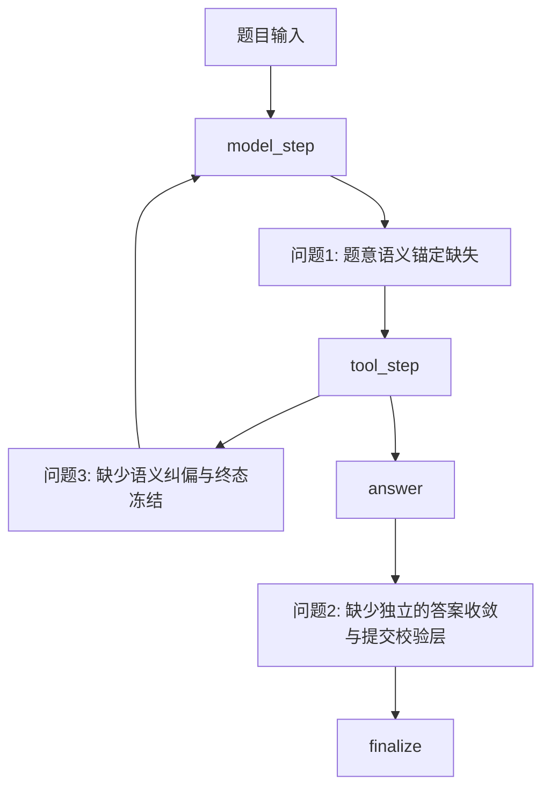

# 当前最关键的 Top3 问题

本文只分析问题，不讨论修复方案。问题排序综合考虑三件事：

1. 在当前公开失败任务中是否高频出现
2. 对正确率和稳定性影响是否足够大
3. 它是否确实暴露了当前 LangGraph 运行时设计的系统性缺口

分析主要依据：

- [`docs/agent_error_analysis_20260412.md`](../agent_error_analysis_20260412.md)
- 当前 LangGraph 运行时实现：
  - [`langgraph_runtime.py`](../../src/data_agent_baseline/agents/langgraph_runtime.py)
  - [`state.py`](../../src/data_agent_baseline/agents/state.py)
  - [`registry.py`](../../src/data_agent_baseline/tools/registry.py)
- 代表性失败任务的 `trace.json`

## 1. 问题与当前运行图的关系

先用一张图说明：这三个问题并不是各自孤立，而是分别卡在当前运行图的不同薄弱点上。

这张图想表达的核心是：

- 问题 1 更偏前段，是“理解题目时就歪了”
- 问题 2 更偏后段，是“最后交卷时没收住”
- 问题 3 贯穿中段，是“发现不对以后不会真正纠偏，也不会及时停下来”

## 2. 问题 1：题意语义锚定缺失，AI 会用“勉强说得过去”的字段或参数曲解题目

这是当前最重要的问题，也是很多错误的真正起点。

## 2.1 问题定义

当前 Agent 在进入执行阶段后，常常会把题目里的自然语言要求，直接投影成一个“看起来差不多”的字段、条件或参数。这个替代并不一定荒谬，甚至在局部上很像正确理解，所以它比“工具直接报错”更危险。

危险之处在于：

- 错误不会马上暴露
- 后续工具调用和中间结果仍然可能看起来很合理
- 直到最后对比 gold 才发现整条链从一开始就跑偏

也就是说，这不是“最后一步算错”，而是“中途分析时就已经换了题”。

## 2.2 它在当前 LangGraph 设计中是如何出现的

从当前运行图看，这个问题与以下设计特点直接相关：

- `init_state` 之后立刻进入 `model_step`
- 图里没有单独的“题意规范化”节点
- 状态里没有显式保存“当前题目语义合同”
- prompt 虽然要求“Do not guess”，但没有图结构层面的硬约束去冻结：
  - 目标字段属于哪一层
  - 过滤条件应该落在哪个表达式
  - 排序/排名语义到底对应哪个字段

因此模型往往是这样工作的：

1. 读取题目
2. 在 `model_step` 里做一轮即时解释
3. 用这轮解释直接驱动工具调用

如果这一步解释本身有偏差，后续整个图都会围绕这个偏差继续推进。

## 2.3 代表性任务示例

### 示例 A：`task_180`

题目要求：

- `more than 29.00 per unit`

但模型把它理解成：

- `Price > 29.00`

而正确语义应是：

- `Price / Amount > 29.00`

这不是一个简单字段 typo，而是把“单价约束”曲解成了“总价约束”。一旦这个条件错了，后面筛出来的人群就整体偏大，最终输出虽然有数据、有表格、有数值，但从筛选基集开始就是错的。

### 示例 B：`task_89`

题目要求：

- `the driver who ranked second`

模型却把它执行成：

- `position = 2`

但根据任务数据与错误报告，正确落点应是：

- `rank = 2`

这类错误最典型地展示了“勉强说得过去”的危险性。因为从英文表面看，`ranked second` 和 `position=2` 很像一回事，所以模型很容易在没有额外语义锚点的情况下直接偷换。

### 示例 C：`task_80`

模型已经找到了正确候选 `driverId`，但最后用的是：

- `qualifying.number`

而不是：

- `drivers.number`

这说明问题并不总是“不会找数据”，很多时候是“知道该找谁，但不知道最终值应该来自哪一层主档”。

### 示例 D：`task_163`

模型算对了总额 `175.39`，但把题目里的 `type` 误答成预算层的 `category`，而不是事件层 `type=Meeting`。这类错误尤其说明：即使中间计算正确，只要最初没有锁住“题目中的字段属于哪一层实体”，结果仍会跑偏。

## 2.4 为什么它影响最大

这个问题排在 Top1，不是因为它最显眼，而是因为它最容易污染整条链路。

一旦题意映射错了，后面即使：

- 工具调用成功
- SQL/Python 没报错
- 中间表也能算出来

最终结果仍然可能是“结构化地错”。这种错比程序崩溃更难察觉，因为它在执行层面往往表现得很顺利。

从失败任务分布看，这类问题既出现在事实表/维表选择上，也出现在条件表达式、排名语义、层级字段归属和计数对象上，覆盖范围很广。

## 2.5 为什么它属于架构/运行时问题，而不只是模型能力问题

当然，模型本身有理解误差。但如果只把这个问题归因于“模型不够聪明”，会忽略当前运行时的结构事实：

- 图中没有单独节点负责冻结题意语义
- 状态中没有显式保存“当前问题合同”
- 后续节点也不会检查“当前执行假设是不是已经偏题”

所以当前架构实际上默认接受了一种工作方式：

- 模型对题意做一次隐式解释
- 然后整个运行图都围绕这次隐式解释工作

这使得“中途曲解题意”不再只是模型偶发犯错，而变成了当前图设计里缺少防线的系统性风险。

---

## 3. 问题 2：图中缺少独立的答案收敛与提交校验层

如果说问题 1 更偏“起点歪了”，那么问题 2 更偏“明明走到最后了，却没把答案收住”。

## 3.1 问题定义

当前系统中，`answer` 是终止工具，但不是独立的答案验证层。这导致 Agent 很容易把：

- 中间结果
- 过宽结果
- 带冗余列的结果
- 粒度尚未收敛的结果

直接提交成最终答案。

所以这一类任务的典型观感是：

- 中间分析看上去已经很接近正确
- 甚至某些值本身是对的
- 但最终提交形状、粒度、列、行数不对

## 3.2 它在当前 LangGraph 设计中是如何出现的

这个问题直接来自当前运行图的终态设计：

1. 模型在 `model_step` 中决定是否调用 `submit_tool_result`
2. 一旦 `tool_step` 收到 `submit_tool_result` 的结果，就把 `state["answer"]` 写入
3. `route_after_tool` 检测到已有 `answer` 后，立即进入 `finalize`

当前图缺少一个独立层来问这些问题：

- 现在这个结果是最终表，还是中间表
- 题目要单行还是多行
- 题目要单列还是多列
- 当前答案是不是还带着解释性辅助列
- 当前粒度是不是已经从明细收敛成题目要求的汇总

`prompt.py` 确实写了 `Answer contract`，但它主要限制的是结构合法性，例如：

- `columns` 必须是字符串列表
- `rows` 必须是二维数组
- 行列长度要匹配

它没有在运行图层面形成真正的“提交前校验节点”。

## 3.2.1 从比赛规则看，为什么“多列提交”会直接伤分

官方规则对 `prediction.csv` 和评分方式有两个非常关键的要求：

1. `prediction.csv` 只需要提交题目要求的结果列
2. 评分按“列内容签名”匹配，而不是按列名匹配

根据官方规则页：

- 输出文件的表头只用于可读性，`column names do not participate in scoring`
- 列顺序不影响评分，系统会按列内容做无序匹配
- 评分时会统计：
  - `Matched Columns`
  - `Gold Columns`
  - `Predicted Columns`
  - `Extra Columns`
- 最终分数使用：
  - `Score = Recall - λ · (Extra Columns / Predicted Columns)`

这意味着，问题 2 里的“多交一列”不是风格问题，而是会直接进入惩罚项。

更具体地说：

- 如果 gold 只需要 1 列，而模型提交了 2 列
- 其中 1 列能匹配 gold，另外 1 列是多余列

那么：

- `Recall = 1 / 1 = 1`
- `Extra Columns / Predicted Columns = 1 / 2 = 0.5`

也就是说，即使主列答对了，仍然会因为多出一列被扣掉一部分分数。规则第 6.4 节也明确写到，评分机制不仅看“是否覆盖 gold”，还要“control redundant output”，鼓励结果“as concise and accurate as possible”。

所以从比赛规则角度看，问题 2 的本质不是“输出不够优雅”，而是：

- 多余列会被当成 `Extra Columns`
- `Extra Columns` 会进入分数惩罚项
- 结果越冗余，惩罚越明显

## 3.3 代表性任务示例

### 示例 A：`task_25`

这是最典型的“单值题交成多行”的案例。

模型已经意识到自己拿到了 12 个并列最小值，但仍然直接把并列集合提交。问题不在于它看不到并列，而在于当前图里没有一层独立机制去拦住这种结果并追问：

- 题目要的是唯一活动名
- 现在为什么有 12 行
- 当前是不是还停留在候选集而不是最终答案

### 示例 B：`task_80`

模型提交的不只是错误号码，还多交了 `driverId`。也就是说，这不是纯数值问题，而是最终提交时没有完成“只保留题目要求列”的收敛。

如果按官方规则看，这类情况有双重影响：

- 语义上，题目只要求号码，`driverId` 属于不该提交的辅助列
- 评分上，这一列如果不能与 gold 的任一列匹配，就会被计入 `Extra Columns`

也就是说，哪怕正确号码列本身是对的，额外提交的 `driverId` 仍会把结果从“本可接近满分”拉低到“带冗余惩罚的分数”。

### 示例 C：`task_163`

模型其实算出了正确总额 `175.39`，但最后把事件层 `type` 错换成预算层 `category`，结果从应该的一行变成两行明细。这个案例非常说明问题 2 的本质：中间过程有价值，但提交阶段没有“最后一次对齐题面”的机制。

### 示例 D：`task_379`

题目要求对第 4 原子的元素做 `tally`，但模型停在“每分子一行”的明细表上，未完成最后的聚合与去重收敛，然后直接提交。

这说明当前图没有明确区分：

- 分析中间表
- 最终提交表

## 3.4 为什么它影响大

这个问题的影响非常直接：

- 有些任务不是不会做，而是不会交卷
- 有些任务不是主值全错，而是最后表结构错
- 有些任务即使数值部分正确，也会因为列、粒度、行数错误而完全 miss gold

从结果上看，这类错误很“亏”。因为它们往往出现在流程末端，意味着前面已经付出了检索、联结、分析的成本，但最终没有转化成有效得分。

如果结合官方规则，这个“亏”会更具体：

- 多交列时，系统不会因为列名好看就放过它
- 只要列内容不能匹配 gold，就会被视为 `Extra Columns`
- 分数不是单纯看 recall，还会减去冗余惩罚

因此问题 2 的损失形式通常有两种：

1. 主列没答对，直接丢失 recall
2. 主列即使答对了，只要多交辅助列，仍然会吃冗余惩罚

这正是为什么问题 2 在比赛语境下不是“格式问题”，而是一个直接影响 leaderboard 分数的问题。

## 3.5 为什么它属于架构/运行时问题，而不只是模型能力问题

如果系统里存在一个独立的提交前收敛层，那么很多这类错误不会直接落盘。当前没有这层结构，所以模型一旦决定调用 `submit_tool_result`，图就默认相信它“已经准备好了”。

换句话说，当前架构把“是否已经足够收敛”这件事完全交给模型自觉判断，而没有图层面的第二道门。这就是为什么它属于运行时设计问题，而不只是回答内容问题。

---

## 4. 问题 3：图中缺少语义纠偏与终态冻结机制，复杂任务容易反复试探直到超步

如果说问题 1 是“起点可能理解错”，问题 2 是“终点可能没收住”，那么问题 3 描述的是中段：一旦模型发现事情不顺，它不会真正纠偏，只会继续试。

## 4.1 问题定义

当前图里存在两种常见的中段失控：

1. 工具/脚本失败后，只修执行形式，不重审语义假设
2. 已经拿到关键证据后，仍然不敢冻结方案并提交

这两种现象表面不同，但本质相近：当前系统没有一个显式机制去声明：

- 现在这条路径已经不成立了
- 现在这些证据已经足够了
- 现在不应该继续试，而应该停下来重新判断

## 4.2 它在当前 LangGraph 设计中是如何出现的

从图结构看，当前中段恢复主要靠两个节点：

- `react_step`
- `repair_step`

但这两个节点的职责其实都很有限：

- `react_step` 的本质是“不要只写 note，继续干活”
- `repair_step` 的本质是“你刚才空 stop 了，请继续”

它们都不是严格意义上的语义纠偏节点。

再看 `tool_step -> model_step` 的主循环：

- 只要没有 `answer`
- 只要没有 `failure_reason`
- 只要没到 `max_steps`

系统就会继续回到 `model_step`

这意味着当前图没有一个独立状态或节点来表达：

- 当前主假设已失效
- 当前信息已经足够形成最小可答结果
- 当前应该停止扩展探索

## 4.3 代表性任务示例

### 示例 A：`task_173`

模型已经掌握了两个关键事实：

- `yearmonth.csv` 中存在 `201306`
- `gasstations.json` 的国家域是 `CZE` / `SVK`

但它仍然反复尝试补一条并不存在的“201306 -> GasStationID -> Country”明细级闭合链路，最后在 `64` step 内没提交答案。

这说明当前系统里没有“证据已经足够”的冻结机制。

### 示例 B：`task_352`

模型一度已经逼近正确的 `event_id` 和目标预算条目，但后来把“大窗口内共同出现”误当成真实关联，之后继续扩大搜索范围，最后 `max_steps` 用尽。这里暴露出的不是单次失误，而是没有中途刹车机制。

### 示例 C：`task_396`

模型已经分别抽取出：

- 身高相关信息
- publisher 映射
- 角色候选集合

但它始终停留在“还想再补一点解析”的状态，没有进入最终 join 和比例计算。结果不是算错，而是没交卷。

### 示例 D：`task_249`

这道题没有超步，但很能说明“只修执行、不修语义”的问题。第一次 Python 因 `NoneType` 报错后，模型第二次确实让程序跑通了，但方法是把两个指标都绑到 `UpVotes` 和 `Age` 同时非空的交集样本上。程序成功了，语义却更偏了。

## 4.4 为什么它影响大

这个问题一方面伤覆盖率，另一方面伤效率：

- 复杂题会在长链路里不断消耗 step
- 多源题会来回切数据源
- 半结构化任务会在“再试一次抽取”里打转
- 出错后看似恢复，实际上只是换了一种偏法继续执行

从批次结果看，这类问题直接导致：

- `173`
- `344`
- `352`
- `396`

这些任务以 `Agent did not submit an answer within max_steps.` 结束。

## 4.5 为什么它属于架构/运行时问题，而不只是模型能力问题

如果当前图里已经有“继续”机制，却没有“真正纠偏”和“及时冻结”机制，那么模型自然更容易表现成：

- 继续探索
- 继续修脚本
- 继续补证据

而不是：

- 停下来承认路径错了
- 重写当前问题假设
- 或者停止扩展，直接提交最小可答结果

因此，问题 3 的根源不只是模型是否够聪明，而是当前运行时只提供了续命能力，没有提供中段收敛能力。

---

## 5. 问题排序依据

最后说明一下为什么当前只保留这 3 个问题，以及为什么是这个顺序。

### 5.1 为什么问题 1 排在 Top1

因为它最容易从源头污染整条链。题意一旦被曲解，后续工具越努力，往往只会把错误包装得更完整。它比程序报错更隐蔽，也比最终答案形状错误更早发生。

### 5.2 为什么问题 2 排在 Top2

因为它最直接造成“前面做了很多，最后没得分”。很多任务不是完全不会做，而是没有把结果收敛成真正可提交的答案。

### 5.3 为什么问题 3 排在 Top3

因为它是复杂任务的主要失控模式。它既解释了超步未提交，也解释了不少“出错后继续错下去”的现象。但相比问题 1 和问题 2，它更多发生在复杂链路的中后段，所以排在第三。

### 5.4 为什么只保留 3 个问题

不是因为其他问题不重要，而是因为这 3 个问题已经覆盖了当前失败任务最核心的三段失控：

- 前段：题意被曲解
- 后段：答案没收住
- 中段：不会纠偏，也不会及时停

这三者合在一起，已经足够解释当前 LangGraph 基线在公开失败任务中暴露出的主要系统性短板。
