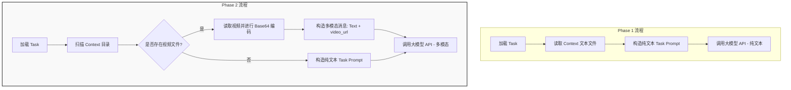

# KDD Cup 2026 DataAgent-Bench: Phase 2 vs Phase 1 变化分析报告

> [!NOTE]
> 本报告基于对官方 `kddcup2026-data-agents-starter-kit` 仓库中 `PHASE_1` 与 `PHASE_2` 目录的完整代码库及文档对比整理而成。旨在帮助参赛选手快速掌握 Phase 2 的核心变化，平滑进行算法和架构的迁移。

---

## 一、 核心变更概览

下表汇总了 Phase 2 相比 Phase 1 在各个维度上的关键变化：

| 变更维度 | Phase 1 状态 | Phase 2 状态 | 变更影响与目的 |
| :--- | :--- | :--- | :--- |
| **数据模态支持** | 仅支持文本/结构化数据（CSV, JSON, SQLite/DB, 文档） | 新增 **视频模态 (Video)** 支持 | 支持更丰富的多模态任务，能够处理视频多媒体上下文。 |
| **消息传递格式** | 纯文本格式 (`str`) | 结构化多模态格式 (`str \| list[dict]`) | 允许向模型传入 Base64 编码的视频多媒体数据流。 |
| **系统提示词** | 强调使用工具检查上下文并获取答案 | 新增**视频观察**规则约束 | 显式要求模型优先阅读视频内容并结合工具进行分析。 |
| **数据源校验** | 严格校验 `task.json` 必须且仅包含 `task_id`, `difficulty`, `question` | 放宽校验，仅强制校验 `task_id` 和 `question` | 提高框架对多样化数据集的鲁棒性，非核心字段缺失不再引发系统崩溃。 |
| **模型调用与超时** | 默认超时无显式设置；默认无最大 token 参数限制 | 显式增加 `timeout=1800.0` (30分钟)、重试机制与 `max_tokens=8192` | 适应视频处理带来的更长耗时与生成开销，防止大视频分析超时以及长文本生成截断。 |
| **公开标准答案** | 提供公开 demo 的 `gold.csv` 以便本地评估 | 不再提供 `gold.csv`，仅提供 `input/` | 模拟 Hidden Test 测试场景，强调模型需要完全自主根据上下文输出并调用 `answer` 提交。 |

---

## 二、 核心变更技术细节分析

### 1. 视频多模态数据流控制

在 Phase 2 中，系统加入了视频检测及 Base64 编码逻辑。以下是消息构建与传递在两个阶段下的流程对比：



#### 代码实现对比：`src/data_agent_baseline/agents/react.py`

在 `react.py` 中，Phase 2 新增了对视频文件的自动发现，并在发送给大模型前对首个视频文件进行 Base64 转换：

```diff
+ VIDEO_EXTENSIONS = {".mp4", ".m4v", ".mov", ".webm", ".mkv", ".avi"}
+ 
+ def _find_first_video(context_dir: Path) -> Path | None:
+     if not context_dir.exists():
+         return None
+     for path in sorted(context_dir.rglob("*")):
+         if path.is_file() and path.suffix.lower() in VIDEO_EXTENSIONS:
+             return path
+     return None
+ 
+ def _build_initial_user_content(task: PublicTask) -> str | list[dict[str, Any]]:
+     task_prompt = build_task_prompt(task)
+     video_path = _find_first_video(task.context_dir)
+     if video_path is None:
+         return task_prompt
+ 
+     mime_type = mimetypes.guess_type(video_path.name)[0] or "video/mp4"
+     video_b64 = base64.b64encode(video_path.read_bytes()).decode("ascii")
+     try:
+         relative_video_path = video_path.relative_to(task.context_dir)
+     except ValueError:
+         relative_video_path = video_path.name
+ 
+     return [
+         {
+             "type": "text",
+             "text": (
+                 f"{task_prompt}\n\n"
+                 f"A video file from the task context is attached: {relative_video_path}."
+             ),
+         },
+         {
+             "type": "video_url",
+             "video_url": {"url": f"data:{mime_type};base64,{video_b64}"},
+         },
+     ]
```

---

### 2. 系统提示词 (System Prompt) 规则变更

为使 Agent 能够意识到视频的存在并将其作为重要上下文依据，`src/data_agent_baseline/agents/prompt.py` 中微调了规则定义：

```diff
 Rules:
-1. Use tools to inspect the available context before answering.
-2. Base your answer only on information you can observe through the provided tools.
+1. Use the attached video and tools to inspect the available context before answering.
+2. Base your answer only on information you can observe in the attached video or through the provided tools.
 3. The task is complete only when you call the `answer` tool.
```

> [!IMPORTANT]
> **变化解读**：
> * 规则 1 强调了必须同时查看“附带的视频”和使用工具。
> * 规则 2 明确了信息来源的边界，要求模型基于**视频中的视觉/听觉信息**或**工具返回的分析数据**来生成最终答案。

---

### 3. 数据校验逻辑放宽

在 Phase 1 中，如果 `task.json` 包含任何意料之外的字段或者缺失非核心字段（如 `difficulty`），系统将直接崩溃报错。Phase 2 对此进行了平滑过渡：

#### 代码实现对比：`src/data_agent_baseline/benchmark/dataset.py`

```diff
 def _load_task_record(task_json_path: Path) -> TaskRecord:
     payload = json.loads(task_json_path.read_text())
-    expected_keys = {"task_id", "difficulty", "question"}
-    actual_keys = set(payload)
-    if actual_keys != expected_keys:
+    required_keys = {"task_id", "question"}
+    missing_keys = required_keys - set(payload)
+    if missing_keys:
         raise ValueError(
             f"Unexpected task.json keys for {task_json_path.parent.name}: "
-            f"expected {sorted(expected_keys)}, got {sorted(actual_keys)}"
+            f"missing required keys {sorted(missing_keys)}"
         )
 
     return TaskRecord(
         task_id=str(payload["task_id"]),
-        difficulty=str(payload["difficulty"]),
+        difficulty=str(payload.get("difficulty", "unknown")),
         question=str(payload["question"]),
     )
```

---

### 4. 模型调用参数与稳定性优化

由于视频输入会导致 API 请求数据体显著增大，且推理耗时大幅延长，Phase 2 显著加强了 API 请求的防御性编程：

#### 代码实现对比：`src/data_agent_baseline/agents/model.py`

* **超时机制与最大重试次数**：
  在初始化 `OpenAI` 客户端时，增加了 `timeout=1800.0` （30分钟）和 `max_retries=1`。
* **输出截断防御**：
  显式将 `max_tokens` 参数设为 `8192`，保证长推理链路的输出不会在途中被截断。
* **多模态返回结果容错**：
  如果模型返回的内容属于多模态结构（例如以分片列表形式返回文本），增加了拼接和过滤空文本的逻辑，保证数据提取的安全。

```diff
         client = OpenAI(
             api_key=self.api_key,
             base_url=self.api_base,
+            timeout=1800.0,
+            max_retries=1,
         )
 
         try:
             response = client.chat.completions.create(
                 model=self.model,
                 messages=[{"role": message.role, "content": message.content} for message in messages],
-                temperature=self.temperature
+                temperature=self.temperature,
+                max_tokens=8192,
             )
```

---

## 三、 对参赛选手的迁移建议

针对 Phase 2 的上述重大变化，建议参赛选手在迁移代码和设计方案时注意以下几点：

> [!TIP]
> 1. **大模型能力选择**：
>    由于 Phase 2 引入了视频模态，所选用的基座模型必须具备**视频理解能力**（例如支持 `video_url` 或者能够处理高分辨率多帧图像序列）。如果选用的模型仅支持文本输入，在遇到带有视频的任务时可能会报错或拒绝回答。
> 2. **优化视频预处理（如有必要）**：
>    Base 示例中采用了“一次性将整个视频文件 Base64 编码并传入”的简单方案。当视频很大时，会产生极高的 Token 消耗甚至超出 API 的上下文限制。在实际优化中，选手可以考虑：
>    * 利用 Python 工具（如 `opencv-python` 或 `ffmpeg`）提取关键帧。
>    * 提取视频的音频并进行语音转文字 (ASR) 预处理，然后作为文本上下文提供给大模型。
> 3. **评估超时与成本**：
>    由于大模型处理视频的时间较长，务必调大本地评估脚本中的 `run.task_timeout_seconds`。同时，多模态 API 调用的 Token 消耗会呈数量级增长，在开发调试阶段建议限制视频大小或抽帧测试以节省额度。
> 4. **本地评估方式的转变**：
>    由于去掉了 `gold.csv`，选手需要自己构建或保留 Phase 1 的标注数据进行本地回归测试，或者依靠自身构建的验证集来进行迭代评估。
