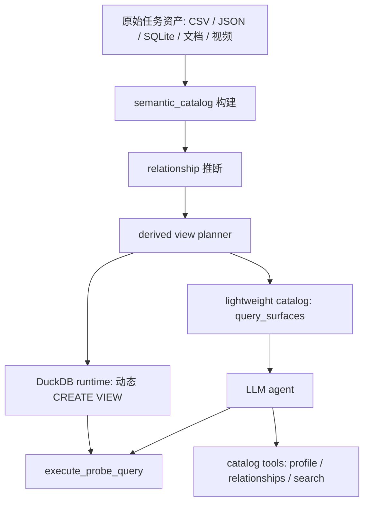

# 预连接语义视图优化设计报告

## 1. 背景与问题

当前 agent 在解答数据题时，会先通过 `semantic_catalog.json` 理解所有结构化资产、字段画像和表间关系。这个机制能提升准确性，但在 task_1 这类多表题里暴露出明显的上下文和推理成本问题。

以 task_1 为例：

- 原始输入包含 CSV、JSON、SQLite、文档和视频等多种资产。
- `semantic_catalog.json` 大约 430KB，包含 25 个 schema 和 110 条 relationships。
- 题目真正需要的核心表很少，主要是 `lc_freefloat` 和 `lc_exgindustry`。
- 当前 trace 成功得出答案，但经历了约 30 步、92 秒，其中多轮都在确认表结构、连接关系和 join SQL。

task_1 的题目是：

> 根据视频中展示的流通A股股本准入线和统计年份口径，统计满足条件的公司数目，按公司所在二级行业分组展示结果。

agent 最终需要做的 SQL 逻辑很简单：

```sql
SELECT
  ei.SecondIndustryName AS 二级行业,
  COUNT(DISTINCT ff.CompanyCode) AS 公司数目
FROM lc_freefloat ff
JOIN lc_exgindustry ei
  ON ff.CompanyCode = ei.CompanyCode
WHERE ff.AFloats > 10000000000
  AND EXTRACT(YEAR FROM ff.ChangeDate) = 2019
GROUP BY ei.SecondIndustryName;
```

真正困难的不是 SQL 聚合，而是 agent 需要先知道：

- `AFloats` 在 `lc_freefloat` 中。
- 二级行业字段在 `lc_exgindustry.SecondIndustryName` 中。
- 两张表通过 `CompanyCode` 连接。
- 同一年多条记录时，需要确认是否按公司去重、是否取年内最新。

其中前三项是机械性的 schema/join 理解，可以由系统预处理承担；最后一项是业务口径判断，仍应保留给 agent 结合题目、视频和数据验证来判断。

## 2. 核心结论

预连接 view 的思路是正确的，但不建议把所有表暴力 join 成一个超级宽表。

推荐方案是：

> 在 `semantic_catalog` 生成 relationships 后，自动识别高置信的事实表到维度表关系，为每张事实表生成一个保守的 enriched semantic view。这个 view 保持事实表原始粒度，只附加常用维度字段，让 agent 优先查询 view，但仍可回退到原始表和 relationships。

以 task_1 为例，生成：

```sql
CREATE VIEW v_lc_freefloat_enriched AS
SELECT
  ff.id,
  ff.CompanyCode,
  ff.SecuCode,
  ff.ChiName,
  ff.ChiNameAbbr,
  ff.ChangeDate,
  ff.TotalAShare,
  ff.AFloats,
  ff.InactiveFloats,
  ff.AdjFreeFloatRatio,
  ff.AdjFreeFloats,
  ei.FirstIndustryName,
  ei.SecondIndustryName
FROM lc_freefloat ff
LEFT JOIN lc_exgindustry ei
  ON ff.CompanyCode = ei.CompanyCode;
```

之后 agent 可以直接写：

```sql
SELECT
  SecondIndustryName AS 二级行业,
  COUNT(DISTINCT CompanyCode) AS 公司数目
FROM v_lc_freefloat_enriched
WHERE AFloats > 10000000000
  AND EXTRACT(YEAR FROM ChangeDate) = 2019
GROUP BY SecondIndustryName;
```

这样可以减少 schema 探索和 join 推理，但不会替 agent 决定筛选阈值、年份、聚合粒度、是否去重等业务逻辑。

## 3. 设计目标

### 3.1 主要目标

1. 减少上下文注入体积不再把大量 schema 字段画像和 110 条 relationships 全量塞给 LLM，而是提供更紧凑的视图索引。
2. 降低 join 推理负担对高置信、常见的事实表到维度表 join，系统提前建好 view，agent 直接查询。
3. 降低 SQL 错误率避免 agent 在每个题里重复选择连接键、处理字段冲突和表名差异。
4. 保持业务口径透明view 只做无损字段增强，不做过滤、聚合、排序、去重、取最新等会改变答案口径的操作。
5. 保留 fallback 能力
   如果题目需要非常规 join、跨事实表 join 或原始字段，agent 仍可查询原始表和调用 relationship 工具。

### 3.2 非目标

第一版不解决以下问题：

- 不自动生成最终答案 SQL。
- 不自动决定时间口径、最新记录、去重规则。
- 不做跨事实表预连接，比如 `lc_freefloat` join `lc_dividend`。
- 不做所有表的超级宽表。
- 不把 view 物化成长期文件，优先在 DuckDB 内存中动态创建。

## 4. 为什么不能直接全量 join

“分析完 join 关系后，直接连一下表形成 view”这个方向要加边界，否则容易引入新的错误。

### 4.1 组合爆炸

task_1 中 relationships 有 110 条，但真正相关的只有少数几条。如果对每条关系都生成 view，或者对所有表组合生成 view，会产生大量无用对象。

更糟糕的是，多个事实表之间也可能共享 `CompanyCode`、`SecuCode`。这类关系并不一定代表可安全 join。比如：

- `lc_freefloat` 是股本变更记录。
- `lc_dividend` 是分红记录。
- `qt_dailyquote` 是交易日行情。

这些表都能按公司连接，但 grain 不同。直接 join 会造成行数膨胀和语义混乱。

### 4.2 宽表膨胀

如果把事实表同时 join 到行业、股票档案、实控人、概念、业务等多个维度，列数会快速膨胀。LLM 看到的字段更多，未必更清楚。

优化目标不是“让字段更多”，而是“让题目相关路径更短”。

### 4.3 隐式改变口径

某些关系不是严格 1:1。例如实控人、行业分类、业务信息可能有时间版本。如果预处理阶段随意取最新一条，会把业务判断隐藏在 view 里。

这会造成两个问题：

- agent 不知道系统替它做了什么选择。
- 错了以后很难定位是数据口径错，还是 agent 逻辑错。

因此 view 必须保持事实表原始粒度，避免隐式聚合或筛选。

## 5. 推荐架构

整体架构分为四层：



### 5.1 Catalog 层

当前 `semantic_catalog` 已经包含：

- `assets`
- `schemas`
- `relationships`
- `query_relevance`
- `semantic_uncertainties`

建议新增：

```json
{
  "derived_views": [
    {
      "name": "v_lc_freefloat_enriched",
      "base_table": "lc_freefloat",
      "grain": "same_as_base_table",
      "description": "lc_freefloat records enriched with industry classification.",
      "columns": [],
      "joins": [],
      "warnings": []
    }
  ]
}
```

这个字段属于完整 catalog，供工具和运行时使用。

派生视图必须显式声明自己不是原始表：

- `kind = "derived_view"`
- `is_original_table = false`
- `knowledge_authority = "source_fields_only"`
- 每个字段都带 `source_table` 和 `source_field`

这条规则用于避免 LLM 把 view 误认为 `knowledge.md` 中描述的原始表。`knowledge.md` 仍然只解释原始表和原始字段；view 只是把字段放到同一个查询入口。

### 5.2 Lightweight Catalog 层

轻量 catalog 不再同时注入 `semantic_views` 和 `structured_tables`。建议用单一 `query_surfaces` 作为首轮查询入口：

```json
{
  "query_surfaces": [
    {
      "table": "v_lc_freefloat_enriched",
      "kind": "derived_view",
      "base_table": "lc_freefloat",
      "is_original_table": false,
      "grain": "same_as_base_table",
      "row_count": 3119,
      "join_status": "enriched",
      "key_columns": [
        "CompanyCode",
        "SecuCode",
        "ChangeDate",
        "AFloats",
        "TotalAShare",
        "FirstIndustryName",
        "SecondIndustryName"
      ],
      "attached_dimensions": [
        {
          "table": "lc_exgindustry",
          "join_key": "CompanyCode",
          "fields": ["FirstIndustryName", "SecondIndustryName"],
          "confidence": 0.99,
          "matched_distinct_ratio": 0.94
        }
      ],
      "warnings": []
    },
    {
      "table": "lc_unjoined_example",
      "kind": "original_table",
      "base_table": "lc_unjoined_example",
      "is_original_table": true,
      "grain": "original_table",
      "row_count": 100,
      "join_status": "not_enriched",
      "key_columns": ["CompanyCode", "EndDate"],
      "attached_dimensions": [],
      "warnings": []
    }
  ]
}
```

prompt 中告诉 agent：

- 从 `query_surfaces` 选择 SQL 查询入口。
- `kind=derived_view` 表示预连接查询便利层，不是 `knowledge.md` 原始表。
- `kind=original_table` 表示未被 enrichment 覆盖的原始逻辑表。
- derived surface 不代表最终业务口径，筛选、时间窗口、去重和聚合仍需根据题目验证。

## 6. View 生成规则

### 6.1 事实表和维度表识别

从 relationships 中识别候选关系：

- source 是事实表。
- target 是维度/lookup 表。
- relationship type 为 `lookup_code`。
- cardinality 为 `many_to_one` 或目标键唯一。
- confidence 高于阈值，建议第一版用 `>= 0.95`。
- target uniqueness ratio 接近 1。

在 task_1 中：

```json
{
  "source": "lc_freefloat.CompanyCode",
  "target": "lc_exgindustry.CompanyCode",
  "cardinality": "many_to_one",
  "confidence": 0.99,
  "matched_source_distinct_ratio": 0.94,
  "target_uniqueness_ratio": 1.0
}
```

这是一条适合生成 view 的关系。

### 6.2 允许 join 的维度类型

第一版建议只自动 join 这类维度表：

- 行业分类表，例如 `lc_exgindustry`
- 股票/证券主数据表，例如 `lc_stockarchives`
- 公司基础信息表，如果目标键唯一且字段稳定

谨慎处理或默认不 join：

- 实控人、股东、概念、业务等可能多版本或多值的数据
- 交易、分红、股本变更、质押等事实表
- row_count 明显大、同一 key 多行的表

### 6.3 字段选择规则

不要把维度表所有字段都塞进 view。字段选择应遵循“高价值、低歧义、低膨胀”原则。

优先保留：

- 名称字段：`ChiName`、`ChiNameAbbr`
- 分类字段：`FirstIndustryName`、`SecondIndustryName`
- 主数据字段：证券代码、上市状态、地区等稳定属性

默认剔除：

- 全空字段
- 技术主键，例如维度表自己的 `id`
- 和事实表重复且无额外价值的 `CompanyCode`、`SecuCode`
- 大文本字段
- 高基数描述字段

字段冲突处理：

- 事实表字段优先保持原名。
- 维度表字段如果与事实表冲突，使用 `{dimension_table_short}_{column}`。
- 对 task_1，`SecondIndustryName` 不冲突，可直接保留。

### 6.4 Join 类型

统一使用 `LEFT JOIN`。

原因：

- 不丢事实表原始记录。
- 未匹配维度的记录保留为 `NULL`，agent 可以识别覆盖率问题。
- 避免系统预处理阶段过早筛掉数据。

如果题目需要只统计有行业分类的公司，agent 可在 SQL 中自行加：

```sql
WHERE SecondIndustryName IS NOT NULL
```

### 6.5 不允许在 view 中做的事

derived view 不应包含：

- `WHERE`
- `GROUP BY`
- `ORDER BY`
- `DISTINCT`
- `ROW_NUMBER`
- `MAX(ChangeDate)` 取最新
- 年份筛选
- 单位换算后的阈值筛选

这些都属于业务逻辑，应由 agent 根据题目和数据验证显式完成。

## 7. Runtime 设计

当前 `execute_probe_query` 已经通过 DuckDB 把 CSV、JSON、SQLite 统一注册成逻辑表。这个基础很好，不需要额外创建数据库文件。

建议在 `create_duckdb_views()` 完成原始逻辑表注册后，追加派生视图注册：

1. 收集当前 SQL 中引用的表名。
2. 如果 SQL 引用了 `v_lc_freefloat_enriched`：
   - 注册其依赖的基表 `lc_freefloat`。
   - 注册其依赖的维度表 `lc_exgindustry`。
   - 执行 `CREATE VIEW v_lc_freefloat_enriched AS ...`。
3. 如果 SQL 没引用派生视图，不创建无关 view，减少运行成本。

伪代码：

```python
def create_derived_views(conn, catalog, sql):
    for view in catalog.get("derived_views", []):
        if not sql_references_view(sql, view["name"]):
            continue
        ensure_dependencies_registered(view)
        conn.execute(render_create_view_sql(view))
```

需要注意：

- SQLite 表目前是按 SQL 引用懒注册的。派生 view 引用 SQLite 维度表时，需要把依赖表也视为被引用。
- CSV/JSON 表已经较容易注册。
- 所有字段名必须用 DuckDB identifier quote，避免大小写和特殊字符问题。

## 8. 工具接口设计

### 8.1 `get_table_profile`

支持：

```json
{"table": "v_lc_freefloat_enriched"}
```

返回：

```json
{
  "table": "v_lc_freefloat_enriched",
  "kind": "derived_view",
  "base_table": "lc_freefloat",
  "grain": "same_as_base_table",
  "fields": [
    {"name": "CompanyCode", "type": "BIGINT", "source_table": "lc_freefloat"},
    {"name": "AFloats", "type": "DOUBLE", "source_table": "lc_freefloat"},
    {"name": "SecondIndustryName", "type": "VARCHAR", "source_table": "lc_exgindustry"}
  ],
  "joins": [
    {
      "dimension_table": "lc_exgindustry",
      "join_type": "left",
      "source_fields": ["CompanyCode"],
      "target_fields": ["CompanyCode"],
      "confidence": 0.99
    }
  ]
}
```

### 8.2 `search_semantic_catalog`

搜索字段时应包含 derived view：

- query: `SecondIndustryName`
- 返回 `v_lc_freefloat_enriched.SecondIndustryName`

搜索表时应包含：

- `v_lc_freefloat_enriched`
- `lc_freefloat`

### 8.3 `get_table_relationships`

对 derived view 返回两类信息：

- view 已内置的 join。
- base table 仍可用的其他 relationships。

这样 agent 在 view 不够用时能继续扩展。

### 8.4 `execute_probe_query`

支持直接查询：

```sql
SELECT *
FROM v_lc_freefloat_enriched
LIMIT 5;
```

如果 view 注册失败，错误信息应说明：

- 哪个 derived view 创建失败。
- 缺少哪个依赖表。
- 可用的原始表或替代 view。

## 9. Agent 提示词调整

在 `<lightweight_catalog>` 前的说明建议改成：

```text
The catalog includes query_surfaces. Start from query_surfaces when choosing SQL
entry points. kind=derived_view surfaces preserve the base table grain and
already include high-confidence lookup dimensions, but they are not original
tables from knowledge.md and do not apply filters, aggregation, de-duplication,
latest-record rules, or unit conversions. kind=original_table surfaces are raw
logical tables. Use semantic catalog tools when you need full field profiles,
source metadata, or relationship evidence.
```

中文含义：

- 从 query_surfaces 选择查询入口。
- derived view 只是预连接字段增强。
- 不要认为 view 已经替你处理了最终统计口径。
- 需要时回退到原始表。

## 10. Task_1 示例链路

### 10.1 当前链路

trace 中 agent 大致经历：

1. 看视频截图，识别阈值和年份。
2. 查 `lc_freefloat` profile。
3. 查 `lc_exgindustry` profile。
4. 自己构造 join。
5. 验证结果。
6. 再次确认是否需要取年内最新。
7. 提交答案。

### 10.2 优化后链路

轻量 catalog 直接出现：

```json
{
  "table": "v_lc_freefloat_enriched",
  "description": "流通股数据，已附加行业分类字段。",
  "key_columns": [
    "CompanyCode",
    "ChangeDate",
    "AFloats",
    "SecondIndustryName"
  ]
}
```

agent 可以：

1. 看视频截图，识别 `AFloats > 10000000000` 和 `ChangeDate 年份 = 2019`。
2. 直接查询 `v_lc_freefloat_enriched`。
3. 验证同一公司多条记录时 `COUNT(DISTINCT CompanyCode)` 是否合理。
4. 提交结果。

预期收益：

- 少查 1-2 次表 profile。
- 少写显式 join。
- 少暴露大量 irrelevant relationships。
- 更容易让模型把注意力放在阈值、时间口径、去重和输出格式上。

## 11. 边界情况与处理

### 11.1 维度匹配率不足

如果 source distinct match ratio 低于阈值，不生成 view，或生成 view 但标记 warning。

建议第一版：

- `matched_source_distinct_ratio >= 0.95` 自动生成。
- `0.85 - 0.95` 可生成但在 `warnings` 中提示覆盖率风险。
- `< 0.85` 不生成。

task_1 中 `lc_freefloat -> lc_exgindustry` 的 distinct match ratio 是 0.94。它略低于 0.95，但 row match ratio 是 0.982，且业务上行业分类是明显维度。可以采用“允许生成但标记覆盖率提示”的策略。

### 11.2 目标表不是唯一键

如果 target key 不唯一，不自动生成普通 enriched view。

可选后续增强：

- 生成 `*_latest_enriched`，但必须明确排序字段和规则。
- 生成聚合维度，例如一个 company 对多个概念时用列表聚合。

第一版不建议做这些，因为会引入隐式业务规则。

### 11.3 多个 join key 候选

同一事实表可能既能按 `CompanyCode` 连，也能按 `SecuCode` 连。

选择策略：

1. 优先使用 confidence 更高的关系。
2. 优先使用匹配率更高的 key。
3. 如果都接近，优先 `CompanyCode`，因为它在该数据域中是公司级稳定主键。
4. 保留另一条关系在 view metadata 中，不重复 join 同一维度表。

### 11.4 字段语义重复

事实表和维度表都可能有 `ChiName`、`ChiNameAbbr`、`SecuCode`。

处理策略：

- 保留事实表字段原名。
- 维度表重复字段默认不加入。
- 如果必须加入，命名为 `industry_ChiName`、`stockarchive_SecuCode`。

### 11.5 跨事实表题目

如果题目需要 `lc_freefloat` 和 `lc_dividend` 一起分析，enriched view 只能解决每个事实表各自连接维度的问题，不能替代 agent 的跨事实 join。

这不是缺陷，而是设计边界：跨事实表 join 往往涉及时间、粒度、重复行处理，应由 agent 显式验证。

## 12. 配置建议

新增配置项：

```yaml
data_inspector:
  semantic_views:
    enabled: true
    min_confidence: 0.95
    min_distinct_match_ratio: 0.90
    strict_distinct_match_ratio: 0.95
    min_target_uniqueness_ratio: 1.0
    max_views: 30
    max_dimension_fields_per_view: 12
    max_dimensions_per_view: 2
    min_payload_fields: 1
    allow_one_to_one_enrichment: false
```

默认策略建议：

- 开启 semantic views。
- 所有 YAML 配置都应显式包含 `data_inspector.semantic_views.enabled`，便于 A/B 测试和一键回退。
- 不通过表名白名单/黑名单判断维度表；只依据 relationship 证据、target key 唯一性和 payload 字段结构。
- 第一版默认只自动生成 many-to-one 的 row-preserving enrichment；one-to-one 关系留给 agent 显式判断。
- 每个 view 附加 lookup target 和字段数量都有限。
- 对覆盖率不足的 view 提示 warning。

## 13. 实施步骤

### Phase 1：View Spec 生成

新增模块，例如：

```text
src/data_agent_baseline/inspectors/semantic_views.py
```

职责：

- 输入 `catalog["relationships"]` 和 logical tables。
- 输出 `catalog["derived_views"]`。
- 不执行 SQL，不访问 DuckDB。

### Phase 2：Lightweight Catalog 注入

修改 `build_lightweight_catalog()`：

- 增加 `query_surfaces`。
- 移除首轮注入中的 `semantic_views` 和 `structured_tables` 双轨结构。
- 每张原始逻辑表最多出现一次：有 derived view 时展示 view，否则展示 original table surface。
- 避免把完整 relationships 注入给模型。

### Phase 3：DuckDB Runtime 支持

修改 `create_duckdb_views()` 或新增辅助函数：

- 根据 SQL 引用注册 derived view。
- 自动注册 derived view 依赖的 SQLite 表。
- 执行 `CREATE VIEW`。

### Phase 4：Catalog Tools 支持

修改：

- `get_table_profile`
- `search_semantic_catalog`
- `get_table_relationships`

让它们认识 derived view。

### Phase 5：A/B 测试和回归

对比开启和关闭 semantic views：

- 成功率
- 平均步骤数
- 平均耗时
- 平均 tool 调用数
- 上下文 token
- SQL 错误次数

## 14. 测试计划

### 14.1 单元测试

1. 高置信 many-to-one 关系生成 view。
2. 低置信关系不生成 view。
3. target key 非唯一不生成 view。
4. 字段冲突时命名稳定。
5. 全空维度字段不进入 view。

### 14.2 工具测试

1. `get_table_profile("v_lc_freefloat_enriched")` 返回 view profile。
2. `search_semantic_catalog("SecondIndustryName")` 返回 view 字段。
3. `execute_probe_query` 能查询 derived view。
4. derived view SQL 中 `LEFT JOIN` 不丢失未匹配事实行。

### 14.3 回归测试

task_1 应继续得到：

```csv
二级行业,公司数目
黑色金属冶炼和压延加工业,1
```

同时 trace 应体现：

- agent 不需要显式 join `lc_freefloat` 和 `lc_exgindustry`。
- agent 仍会验证年份、阈值和 distinct company 口径。

### 14.4 性能测试

记录以下指标：

- lightweight catalog 字符数。
- 第一次模型请求 token。
- agent 总步骤数。
- `get_table_profile` 调用次数。
- `execute_probe_query` 调用次数。
- 总耗时。

## 15. 风险与缓解

| 风险                  | 影响             | 缓解                                        |
| --------------------- | ---------------- | ------------------------------------------- |
| view 过多             | catalog 仍然变大 | 限制 max_views，只生成稳定维度              |
| view 字段过多         | LLM 仍然难读     | 限制维度字段数，只放 key fields             |
| 错误 join             | 答案错误         | 仅使用高置信关系，并保留 join metadata      |
| 隐式业务口径          | 难以审计         | view 禁止筛选、聚合、取最新                 |
| SQLite 懒注册依赖遗漏 | 查询 view 失败   | view runtime 显式注册依赖表                 |
| agent 过度依赖 view   | 忽略原始表       | prompt 明确 view 是优先路径但不是唯一数据源 |

## 16. 最终建议

建议采用“保守 enriched semantic view”方案，而不是“全量预 join 宽表”方案。

第一版只做三件事：从 relationships 中挑选高置信事实表到维度表关系。

1. 为事实表动态生成 `v_{table}_enriched`，保持原始粒度，只附加稳定维度字段。
3. 在 lightweight catalog 中优先展示这些 semantic views，让 agent 少看 schema、少写 join、多关注业务口径。

这个方案对 task_1 很匹配，也能推广到相似问题。它的关键优点是：优化了 agent 的认知路径，但没有把答案逻辑藏进预处理阶段。
