# 两阶段数据理解架构

## 概述

在原始架构中，系统接到用户问题后，首先通过 `perceive_task` 节点让 LLM 从问题文本中提取实体、过滤词和风险项，然后在 `understand_and_explore_data` 节点中将问题概念映射到实际 schema 字段，最后交给主 Agent 求解。

新架构将数据探查拆分为**两个独立阶段**：

1. **阶段 1 — 全局数据探索**：在还不知道问题的情况下，全面探索所有数据资产，生成一份 **GlobalDataProfile**（一段 LLM 生成的 markdown 文本，总结所有表、实体、关系、数据质量）
2. **阶段 2 — 问题导向的 Handoff**：引入用户问题，结合 GlobalDataProfile 生成精确的 **DataUnderstandingHandoff**（实体映射、连接路径、答案契约、过滤条件）

核心收益：阶段 1 不被问题范围限制，能发现全局的数据关系和质量问题；阶段 2 基于完整的全局认知做 grounded mapping，结果更准确。

---

## 整体节点图

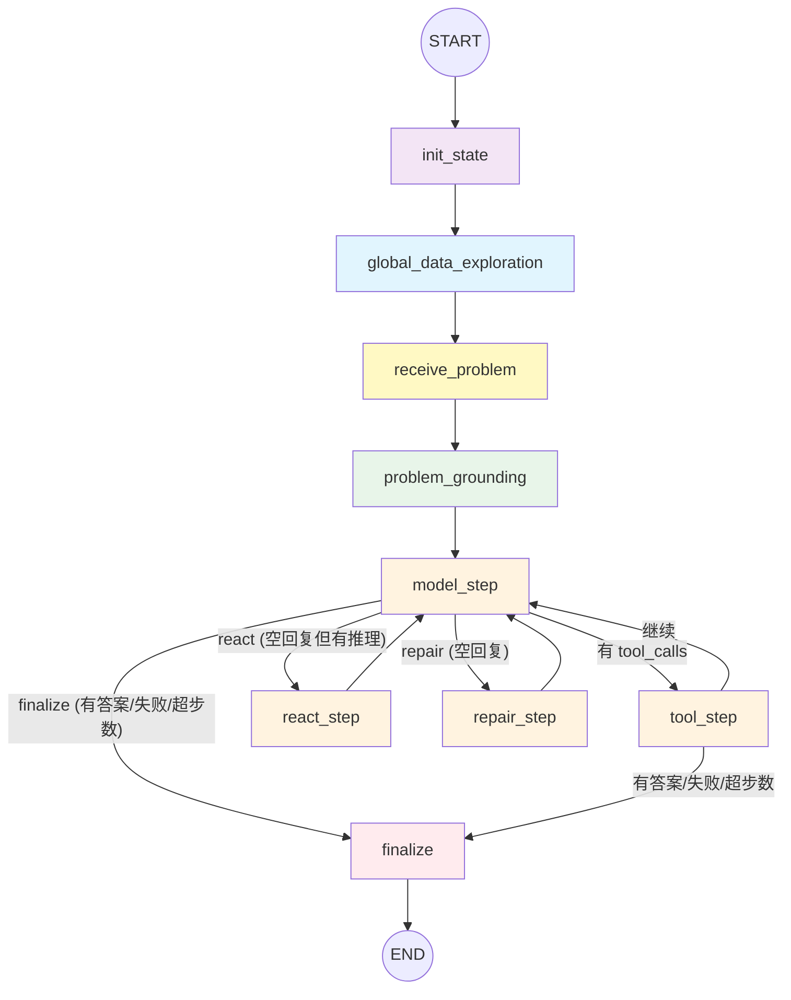

**图例**：
- 蓝色：阶段 1 — 全局数据探索
- 黄色：问题注入
- 绿色：阶段 2 — 问题接地
- 紫色：状态初始化
- 橙色：主 Agent 推理/工具/修复循环
- 红色：终结

---

## 详细节点说明

### 0. AgentGraphState（全局状态）

整个流程共享一个 `AgentGraphState`（TypedDict），关键字段如下：

| 字段 | 类型 | 说明 |
|------|------|------|
| `task_id` | `str` | 任务 ID |
| `messages` | `list[BaseMessage]` | LangChain 消息列表，跨节点累加 |
| `step_count` | `int` | 主 Agent 已执行的步数 |
| `answer` | `AnswerTable \| None` | 最终提交的答案表 |
| `failure_reason` | `str \| None` | 失败原因 |
| `steps` | `list[dict]` | 执行步骤记录（trace 用） |
| `tool_events` | `list[dict]` | 工具调用事件记录 |
| `inspector` | `dict \| None` | DataUnderstandingResult 序列化结果 |
| `global_data_profile` | `str \| None` | **阶段 1 产出的全局数据画像** |

---

### 1. init_state — 状态初始化

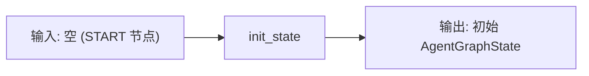

**功能**：初始化 LangGraph 状态，只添加 SystemMessage（不再包含问题）

**提示词**：`build_system_prompt()` 返回 `SYSTEM_PROMPT`
- 定义 Agent 的身份（工具型数据分析智能体）
- 回合策略、工具策略、路径规则
- Handoff 使用规则（信任手、不重复验证）
- 答案提交规范（columns/rows 格式）

**初始状态**：

```python
{
    "task_id": task.task_id,
    "messages": [SystemMessage(content=build_system_prompt())],
    "step_count": 0,
    "empty_stop_retry_count": 0,
    "react_retry_count": 0,
    "answer": None,
    "failure_reason": None,
    "steps": [],
    "tool_events": [],
    "temp_workspace": None,
    "inspector": None,
    "global_data_profile": None,  # 阶段 1 产物，初始为空
    "started_at": "2026-05-07T12:00:00Z",
}
```

---

### 2. global_data_exploration — 全局数据探索（新增节点）

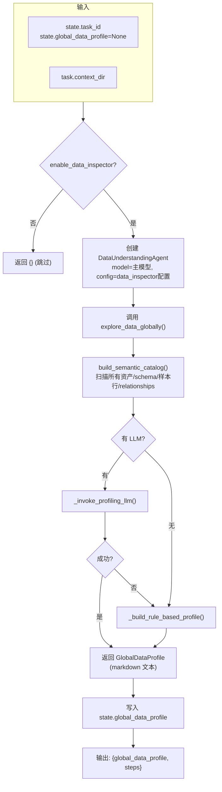

**功能**：在不看问题的情况下，全面探索所有数据资产

**内部流程**：

1. 创建 `DataUnderstandingAgent`，调用 `explore_data_globally(context_dir, task_id)`
2. 内部调用 `build_semantic_catalog()` 扫描所有资产：
   - CSV / JSON / SQLite / 文档文件
   - 每个文件的 schema、字段名、样本行
   - `relationships`：跨资产的共享字段（如 `event_id` 同时出现在 `event.json` 和 `expense.json`）
   - `semantic_uncertainties`：字段歧义、层级模糊等
3. 提取 knowledge 文档内容（`kind == "document"` 的 schema）
4. **如果有 LLM**：调用 `_invoke_profiling_llm()` 生成高质量 profile
5. **如果无 LLM 或 LLM 失败**：回退到 `_build_rule_based_profile()` 规则生成

**LLM Profiling 提示词**：

`GLOBAL_DATA_PROFILING_SYSTEM_PROMPT`：
```
You are DataProfilingAgent. Your task is to analyze the complete data catalog
of a task context and produce a concise GlobalDataProfile that will guide
later question-specific data understanding.

You do not see the user's question. You do not compute answers, map specific
fields, or build join paths. Your only output is a structured profile describing
what the data landscape looks like.
```

`build_global_profiling_prompt(catalog, knowledge_docs)` 将以下内容打包为 JSON：
- `assets`：资产列表（路径、类型、大小）
- `schemas`：每个 schema 的字段定义、样本行（前 5 行）、文档内容预览（前 4000 字符）
- `relationships`：前 20 条跨资产关系
- `semantic_uncertainties`：schema 层面的不确定性
- `knowledge_documents`：知识文档内容（每篇前 4000 字符）
- `required_json_schema`：要求返回 `{"profile_markdown": "..."}`

**LLM 输出**：一个 JSON 对象，包含 `profile_markdown` 字段，例如：

```markdown
## Data Landscape

### Assets
- **csv/students.csv**: Student enrollment records with demographic and academic attributes
- **json/exams.json**: Examination results linked to students via student_id
- **docs/data_dictionary.md**: Business definitions for status codes and grade levels

### Core Entities
- **Student** (csv/students.csv): id, name, sex, grade_level, school_id
- **Exam** (json/exams.json.records): student_id, subject, score, exam_date

### Relationships
- `student_id` connects students.csv with exams.json.records
- `school_id` in students.csv could join to school-level data if available

### Data Quality
- csv/students.csv: grade_level contains values 9-12, no nulls
- json/exams.json.records: score range 0-100, 3% null in subject field

### Domain Terminology (from docs/data_dictionary.md)
- "Grade 9" = freshman, "Grade 10" = sophomore, etc.
- Score >= 60 is passing; score >= 90 is honors
```

**规则回退（无 LLM 时）**：`_build_rule_based_profile()` 直接用 catalog 信息拼出结构化文本：
```
## Global Data Profile (rule-based fallback)

### Assets
- **csv/students.csv** (csv)
- **json/exams.json** (json)

### Schemas
- csv/students.csv: id, name, sex, grade_level, school_id
- json/exams.json: student_id, subject, score, exam_date

### Relationships
- `student_id` across 2 assets

### Knowledge Documents
- ...
```

**输出到 State**：
```python
{
    "global_data_profile": "<markdown 文本>",
    "steps": [{
        "step_index": 1,
        "node": "global_data_exploration",
        "assistant_message": "<profile 前 500 字符预览>",
        "tool_results": [{"ok": True, "content": {"profile_length": 1500}}],
        "ok": True,
    }]
}
```

---

### 3. receive_problem — 问题注入（新增节点）

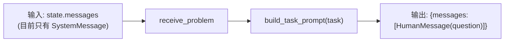

**功能**：将用户问题作为 `HumanMessage` 注入到消息流中

**提示词**：`build_task_prompt(task)` 生成：
```
Question: {task.question}
All tool file paths are relative to the task context directory.
When you use a file path, pass it exactly as listed by `list_context`...
If a Data Understanding Brief and full handoff JSON are provided in the conversation,
trust them as the starting map for field selection, join paths, tie handling, and answer shape...
```

**输出到 State**：
```python
{
    "messages": [HumanMessage(content="Question: ...")]
}
```

此时 state.messages 的完整序列为：
```
[SystemMessage(系统提示), HumanMessage(问题)]
```

---

### 4. problem_grounding — 问题接地（重命名自 understand_and_explore_data）

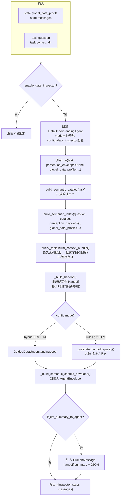

**功能**：将问题结合 GlobalDataProfile，做精确的字段接地和交接生成

**内部流程**：

#### Step 1：构建语义目录和索引
- `build_semantic_catalog(task)`：扫描所有资产，构建完整目录
- `build_semantic_index(question, catalog, perception_payload={}, global_data_profile=...)`：构建关键词索引，用于语义搜索

#### Step 2：构建上下文包（Context Bundle）
- 如果 `enable_semantic_tools=True`：通过 `SemanticQueryTools.build_context_bundle()` 进行语义搜索
  - 搜索语义索引（字段名、别名匹配）
  - 查找 knowledge 文档中的相关定义
  - 发现连接路径（join paths）
  - 生成候选字段列表
- 否则：直接使用 catalog 中的 `query_relevance.relevant_fields`

#### Step 3：生成确定性 Handoff
`_build_handoff()` 基于规则生成初始的 `DataUnderstandingHandoff`：
- 从 context_bundle 中提取候选字段
- 匹配实体、指标、过滤条件
- 生成连接路径

#### Step 4：引导回路（仅在 `mode="hybrid"` 且有 LLM 时）

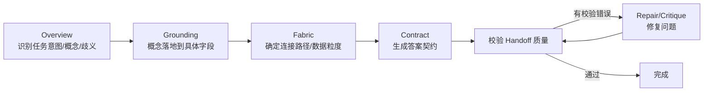

每个阶段通过 `build_guided_phase_prompt()` 生成 JSON 提示，其中包含：
- `phase`：当前阶段名
- `phase_mode`：`probe`（可请求工具）或 `final`（直接输出草稿）
- `question`：原始问题
- `initial_context_bundle`：语义索引结果
- `allowed_field_refs`：允许引用的字段白名单
- `working_memory`：前面阶段已接受的草稿
- `tool_observations`：工具调用的观察结果（最近 8 条）
- `global_data_profile`：**阶段 1 产出的全局画像**（截断至 6000 字符）
- `phase_instruction`：当前阶段的任务指令
- `required_json_schema`：当前阶段必须返回的 JSON 结构

**引导回路可用的语义工具**：
- `search_semantic_index`：搜索文件/字段索引
- `lookup_knowledge`：查找知识库文档
- `get_asset_schema`：获取资产的 schema 和样本数据
- `execute_probe_query`：执行 SQL 查询验证假设
- `get_column_distinct_values`：获取列的 distinct 值

**各阶段 Pydantic 输出模型**：

| 阶段 | 输出模型 | 关键字段 |
|------|---------|---------|
| Overview | `OverviewDraft` | `task_intent`, `concepts[]`, `ambiguity_targets[]`, `tool_requests[]` |
| Grounding | `GroundingDraft` | `grounded_concepts[]` (每个概念的 `accepted_fields[]`/`rejected_fields[]`) |
| Fabric | `FabricDraft` | `join_paths[]`, `data_grain`, `relationship_risks[]` |
| Contract | `ContractDraft` | `answer_columns[]`, `filters[]`, `metric_operation`, `row_policy`, `row_source`, `output_grain` |
| Repair | `RepairDraft` | `contract_patch`, `grounded_concepts[]` 修复 |

#### Step 5：封装 SemanticContextEnvelope

`_build_semantic_context_envelope()` 将结果封装为 `AgentEnvelope`，包含：
- `resources[]`：资产引用（路径、类型、推荐工具）
- `artifacts[]`：输出工件（semantic_catalog、semantic_index、handoff JSON）
- `claims[]`：从 catalog relationships 提取的语义声明（如 `event_id` 出现在 3 个资产中）
- `uncertainties[]`：从 catalog semantic_uncertainties 提取的不确定性
- `content`：human-readable 的 summary（handoff 的简要 markdown 文本）

#### Step 6：注入到 Agent 消息

如果 `inject_summary_to_agent=True`，将 handoff 作为 `HumanMessage` 注入到消息流：

```
{summary markdown}

Full data_understanding_handoff.json:
```json
{
  "question_grounding": { ... },
  "data_fabric": { ... },
  "answer_contract": { ... }
}
```

Treat this handoff as trusted guidance from a separate data understanding agent.
Use the full JSON for structured fields, join paths, answer contract, rejected fields,
row source, filters, join policy, and validation status. Do not re-verify it by default;
call tools only to compute the requested result, resolve validation warnings or missing details,
or investigate a clear conflict.
```

**输出到 State**：
```python
{
    "inspector": {
        "perception": {},
        "semantic_catalog": {...},
        "semantic_index": {...},
        "data_understanding_handoff": {
            "question_grounding": {...},
            "data_fabric": {...},
            "answer_contract": {...},
            "handoff_status": "complete",
            "validation_errors": [],
            "brief_markdown": "..."
        },
        "summary": "...",
        "handoff_status": "complete",
    },
    "steps": [{
        "step_index": 3,
        "node": "problem_grounding",
        "assistant_message": "<handoff summary>",
        "tool_results": [{
            "ok": True,
            "content": {
                "asset_count": 5,
                "schema_count": 5,
                "handoff_status": "complete",
                "validation_errors": [],
            }
        }],
        "ok": True,
    }],
    "messages": [HumanMessage(content="<handoff summary + JSON>")]
}
```

此时 state.messages 的完整序列为：
```
[SystemMessage(系统提示), HumanMessage(问题), HumanMessage(handoff)]
```

---

### 5. model_step — 主 Agent 推理

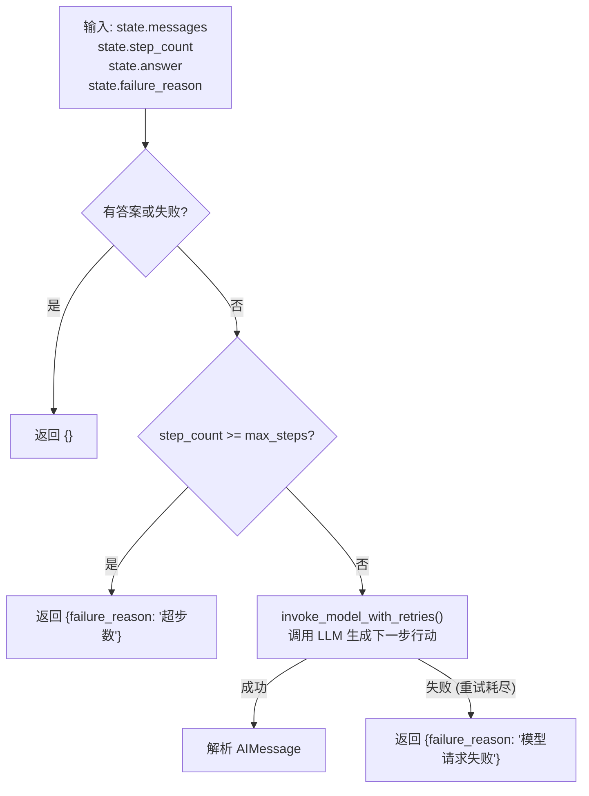

**功能**：调用 LLM 推理下一步行动

LLM 收到的完整消息上下文：
```
[SystemMessage(系统提示)]
[HumanMessage(问题)]
[HumanMessage(handoff + JSON)]             ← problem_grounding 注入
[AIMessage(tool_calls=[...])]              ← 之前的工具调用
[ToolMessage(content=..., name=...)]       ← 工具执行结果
[HumanMessage(reasoning_context)]          ← 推理继续提示
```

LLM 可能返回：
- `AIMessage(tool_calls=[...])` → 调用工具
- `AIMessage(content="working note")` → 工作笔记（需继续）
- `AIMessage(content="")` + 空 tool_calls → 空回复（需修复）

**输出到 State**：
```python
{
    "messages": [AIMessage(...)],
    "step_count": step_count + 1,
    "steps": [{
        "step_index": N,
        "node": "model",
        "assistant_message": "<模型回复内容预览>",
        "tool_calls": [...],
        "model_request": {
            "messages": [...],
            "tools": [...],
        },
        "model_response": {
            "content": "...",
            "tool_calls": [...],
            "finish_reason": "...",
            "token_usage": {...},
        },
        "ok": True,
    }],
}
```

---

### 6. tool_step — 工具执行

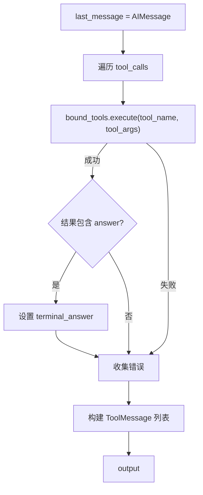

**功能**：执行 LLM 请求的工具调用

主 Agent 可用的工具包括：
- `list_context`：列出上下文目录
- `read_csv` / `read_json` / `read_doc`：读取文件
- `inspect_sqlite_schema`：查看 SQLite schema
- `execute_context_sql`：执行 SQL 查询
- `execute_python`：执行 Python 代码（过滤/连接/聚合）
- `answer`：提交最终答案

**输出到 State**：
```python
{
    "messages": [ToolMessage(...), ...],
    "answer": AnswerTable(...) | None,  # 如果调用了 answer 工具
    "tool_events": [{"ok": True/False, "tool": "...", "content": ...}],
    "steps": [{
        "step_index": N,
        "node": "tool",
        "tool_calls": [...],
        "tool_results": [...],
        "ok": True/False,
    }],
}
```

---

### 7. react_step — 推理继续

**触发条件**：LLM 返回了包含推理但无 tool_call 的 AIMessage（`_has_reasoning_note`），且未超过 `react_retry_limit`

**功能**：追加 `REACT_CONTINUATION_PROMPT` 作为 HumanMessage，引导模型继续行动

```python
{"messages": [HumanMessage(content="Continue. If you have enough information, call answer now.")]}
```

---

### 8. repair_step — 空回复修复

**触发条件**：LLM 返回了空回复（`_is_empty_stop`），且未超过 `empty_stop_retry_limit`

**功能**：追加 `EMPTY_STOP_REPAIR_PROMPT` 作为 HumanMessage，引导模型产生输出

---

### 9. finalize — 最终化

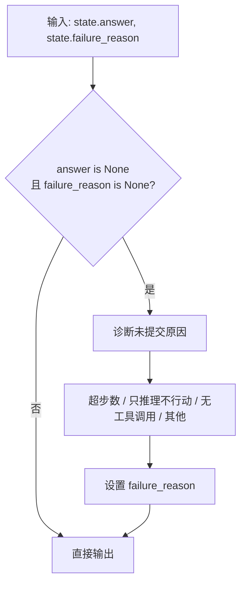

**功能**：检查 Agent 是否在未提交答案的情况下退出，并设置相应的失败原因

---

## 路由逻辑

### 在 model_step 之后 (`route_after_model`)

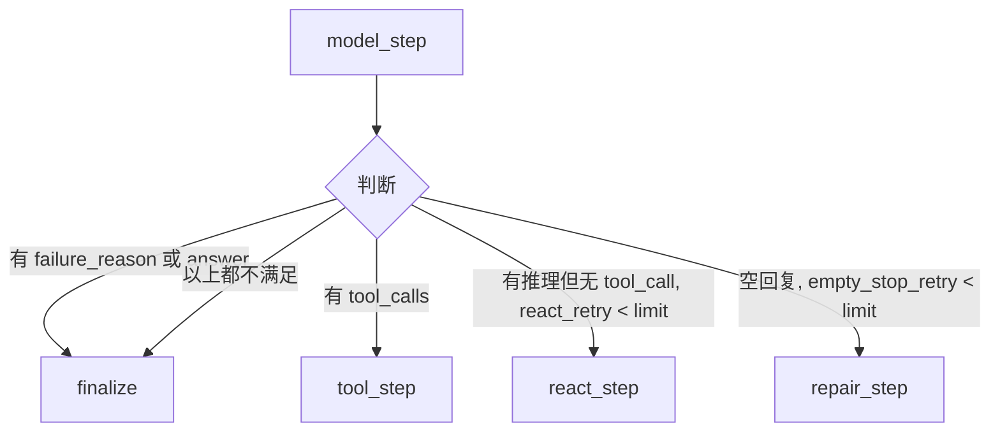

### 在 tool_step 之后 (`route_after_tool`)

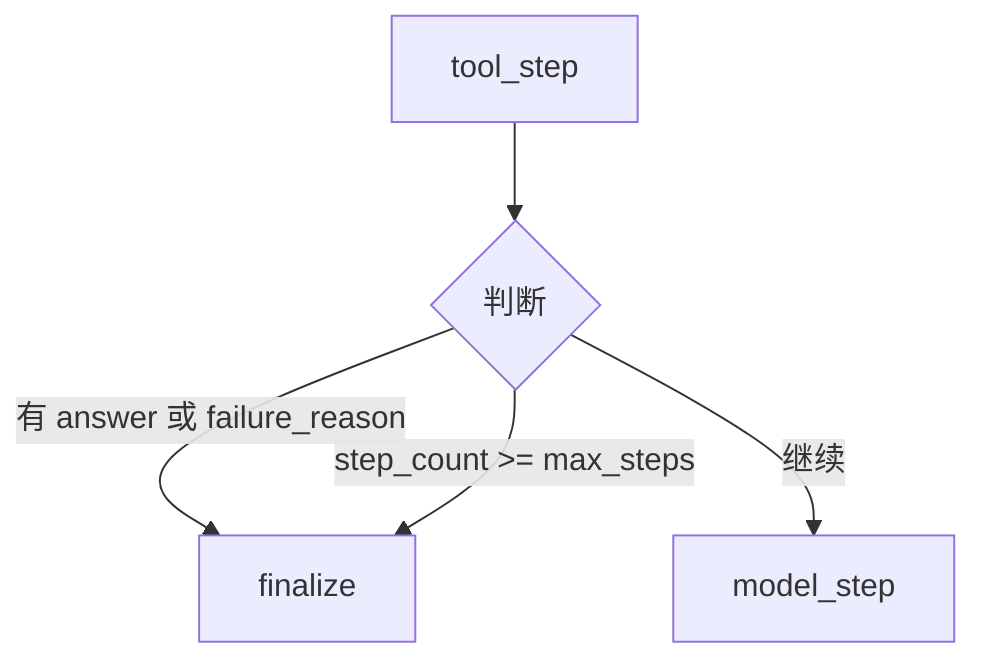

---

## LLM 调用次数对比

| 阶段 | 旧架构 | 新架构 |
|------|--------|--------|
| 数据探查（不知问题） | 无 | **1 次**（GlobalDataProfile profiling LLM） |
| 数据探查（知问题） | **1 次**（Perception LLM） | 0 |
| 引导回路（Overview） | 1 次 | 1 次 |
| 引导回路（Grounding） | 1 次 | 1 次 |
| 引导回路（Fabric） | 1 次 | 1 次 |
| 引导回路（Contract） | 1 次 | 1 次 |
| 引导回路（Repair） | 按需 | 按需 |
| 主 Agent 推理 | N 次 | N 次 |
| **总计** | 5+N 次 | **5+N 次**（1:1 替换） |

新架构不增加 LLM 调用次数，只是将 Perception LLM 调用替换为更全面的 GlobalProfiling LLM 调用。

---

## 配置控制

### DataInspectorConfig

```python
class DataInspectorConfig:
    mode: str = "hybrid"           # "hybrid" = LLM引导回路; "rules" = 仅确定性规则
    inject_summary_to_agent: bool = True   # 是否将 handoff 注入到 Agent 消息
    max_agent_steps: int = 5       # 引导回路最大步数
    max_phase_retries: int = 1     # 每个阶段最大重试次数
    enable_semantic_tools: bool = True    # 是否启用语义搜索工具
    include_inspector_trace: bool = True  # 是否在 trace 中包含 inspector 细节
    context_bundle_limit: int = 6  # 上下文包候选数限制
    max_join_hops: int = 3         # 最大连接跳数
```

### LangGraphAgentConfig

```python
class LangGraphAgentConfig:
    enable_data_inspector: bool = False  # 总开关：是否启用数据理解
    max_steps: int = 20                  # 主 Agent 最大推理步数
    react_retry_limit: int = 2           # 推理继续重试上限
    empty_stop_retry_limit: int = 2      # 空回复修复重试上限
    data_inspector: DataInspectorConfig  # 数据理解子配置
```

当 `enable_data_inspector=False` 时，`global_data_exploration` 和 `problem_grounding` 两个节点直接返回空 `{}`，流程退化为：

```
START → init_state → [global_data_exploration(跳过)] → [receive_problem] → [problem_grounding(跳过)] → model_step → ...
```

即：系统提示 + 问题 → 直接交给主 Agent 求解，无数据理解辅助。
