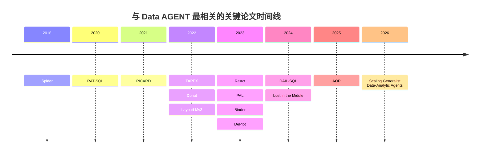
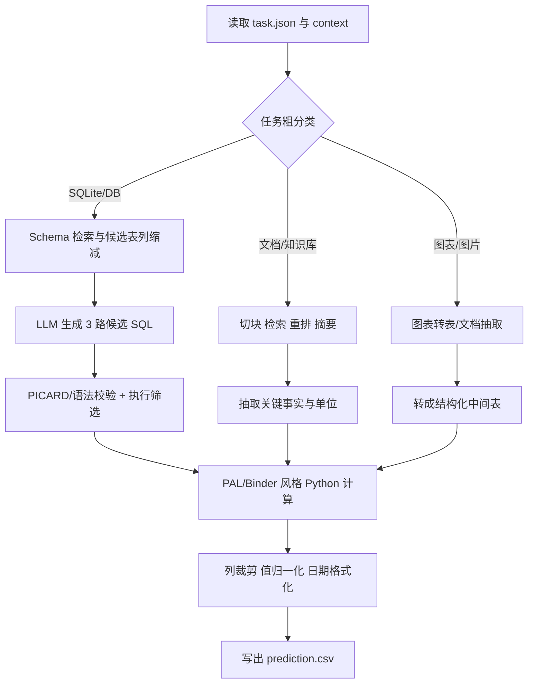

# Data AGENT 竞赛深度研究报告

## 执行摘要

这项比赛的本质，不是“单轮问答”或“单模态表格问答”，而是**在受限执行环境中，自动编排多步数据分析工作流**：输入是一个由 CSV/JSON、SQLite、知识文档、报告文档、图表图像等组成的异构数据包，输出是最终答案表 `prediction.csv`。官网给出的期望能力包括任务分解、工具选择与调用、跨模态推理以及中间结果综合；Phase 2 还会进一步引入 data images / data videos。官方 starter kit 是一个最小化 ReAct 基线：读取 `context/`，通过 `list_context / read_doc / read_json / read_csv / inspect_sqlite_schema / execute_context_sql / execute_python / answer` 等工具做逐步推理，并把每个任务的 `trace.json` 与 `prediction.csv` 写出。citeturn10view0turn4view0turn11view0turn13view0

对参赛者最关键的现实约束有四条。第一，**官方评测是统一模型评测**：提交后必须通过 `MODEL_API_URL` 调用统一部署的 `Qwen3.5-35B-A3B`，容器内**不得**用其他 LLM 作为主求解器；但可在硬件限制内使用辅助模型做检索、文档处理或表征。第二，评测容器只有 **16 vCPU、64GB RAM、无 GPU、总时限 12 小时**，且**外网全断**。第三，官方后端支持 OpenAI 风格 tool calling、自动工具选择与长上下文。第四，当前网页存在**评分描述冲突**：主页仍写成“二值列匹配，额外列不扣分”，但技术规则页已改为 `Score = Recall - λ·(Extra Columns / Predicted Columns)`，且规则页明确说明若与其他页面冲突，以最新技术规则为准；同时 `λ` 的具体取值没有公开。对实战而言，这意味着你不能再把“多报几列碰碰运气”视作无害操作，输出表需要更保守、更精炼。citeturn32view0turn32view2turn32view3turn5view4turn5view5turn10view0turn6view2turn5view0

从学术支撑上看，最值得优先吸收的不是一组“万能新模型”，而是三条互补路线。**第一条是代理编排与程序执行**：用 ReAct / AOP / PAL / Binder 把“规划—查证—执行—计算—收敛”做成显式工作流，而不是让模型一口气输出最终答案。**第二条是结构化数据与 Text-to-SQL**：用 Spider、RAT-SQL、PICARD、TAPEX、DAIL-SQL 解决 schema linking、SQL 约束解码、演示检索和 SQL/表格理解。**第三条是文档图表与长上下文**：用 DePlot 处理图表图像，用 Donut / LayoutLMv3 处理文档图像或复杂页面，用 Lost in the Middle 指导长文档切块、重排和分阶段检索。结合竞赛约束，我认为最能立刻转化为榜单收益的五篇是：**ReAct、AOP、DAIL-SQL、PICARD、Lost in the Middle**；若你的瓶颈集中在图表题，再把 **DePlot** 提前。citeturn20search0turn20search1turn20search2turn35search2turn21search0turn21search1turn31search7turn22search2turn23search10turn31search0turn21search3

截至 2026-04-20，官网时间线显示比赛仍处注册窗口，Phase 1 要到 **2026-04-24 (AoE)** 才开始；因此网站虽有 Leaderboard 入口，但目前公开解析结果未抽取到具体队伍名次和分数。这一项应视为**“页面存在，但公开榜单内容当前未指定/未公开可解析”**。citeturn10view0turn7search1

## 赛题拆解与关键约束

这项 KDD Cup 2026 竞赛由 entity["organization","Tsinghua University","university in beijing"] 与 entity["organization","HKUST (Guangzhou)","university in guangzhou"] 组织，属于 entity["organization","ACM SIGKDD","data mining society"] KDD Cup 2026 体系。官网把目标定义得很清楚：构建能够自动拆解复杂分析问题、在异构数据源之间进行多步推理并产出准确答案的 Data Agent。样例任务要求先从 PDF 报告里找出同比增速最高的区域，再去 SQLite 数据库里汇总某类产品销售额，然后从图表中读季度目标，最后用 Python 做百分比计算。这说明赛题的“最小难点单元”并不是 SQL、OCR 或算术本身，而是**跨源路由与工作流收敛**。citeturn10view0

公开可提炼出的任务/数据/评价/基线如下表所示；其中我把“未指定”或“互相冲突”的地方单独标出，便于你在实现时做防御性设计。

| 维度 | 官网/规则可提炼信息 | 对参赛实现的含义 | 来源 |
| --- | --- | --- | --- |
| 任务定义 | 单个任务是一个 self-contained data package + 一个自然语言分析问题；需要自主编排复杂推理流程。 | 必须把系统做成**任务编排器**，不是纯 QA 模型。 | citeturn10view0 |
| 数据组织 | `/input/task_<id>/task.json` + `context/`；`context/` 下可能有 `csv/`、`db/`、`json/`、`doc/`、`knowledge.md`，不同任务组合不固定。 | 不能写死路径；必须做动态文件发现。 | citeturn3search1turn32view2 |
| 难度分层 | Phase 1 有 Easy / Medium / Hard / Extreme；分别对应 Python 工作流、Text-to-SQL、多源分析、长文档/超长上下文。 | 难度可作为路由信号：easy 走代码/表格优先，hard/extreme 走检索+分阶段推理。 | citeturn10view0 |
| 输出格式 | 必须为 `/output/task_<id>/prediction.csv`。 | 最终答案必须结构化成表，不是自由文本。 | citeturn3search1 |
| 主页评分说明 | 首页写“binary column-matching”，只要 gold 列全覆盖即可，额外列不影响得分。 | **不要直接相信主页摘要。** | citeturn10view0 |
| 规则页评分说明 | 规则页写为列签名匹配 + `Score = Recall - λ·(Extra Columns / Predicted Columns)`，有数值/时间归一化，字符串大小写敏感。 | 输出列数必须克制；数值保留 2 位小数、日期 ISO 化、时区统一。 | citeturn6view2 |
| 评分冲突处理 | 规则页声明：若与其他页面冲突，以规则页最新版为准。 | 工程上应按**惩罚冗余列**来优化。 | citeturn5view0 |
| `λ` | 未公开。 | 本地调参时把“尽量少输出无关列”当硬约束。 | citeturn6view2 |
| 公开 demo 数据 | Phase 1 demo 数据提供 Google Drive / 百度网盘镜像；隐藏测试只有 `input/` 没有 `output/`。 | 本地必须模拟“只见输入不见金标”。 | citeturn10view0turn18view4 |
| Phase 2 | Leaderboard subtrack 会增加 data images / data videos；Creative subtrack 强调系统设计与交互。 | 图表/图像模块现在就应预留接口。 | citeturn10view0 |
| 基线代码 | starter kit 提供 ReAct baseline、dataset loader、CLI；核心模块包括 prompt、react runtime、tool registry、runner。 | 这是推荐的最小可复现起点，但远非强基线。 | citeturn4view0turn11view0 |
| 基线工具 | `list_context`、`read_csv`、`read_json`、`read_doc`、`inspect_sqlite_schema`、`execute_context_sql`、`execute_python`、`answer`。 | 你最该强化的是**工具路由与观察压缩**。 | citeturn11view3turn17view6 |
| 基线默认参数 | README prose 里 `max_workers` 写 4；示例 YAML 文件里 `max_workers` 实际为 8；`max_steps=16`、`temperature=0.0`、`task_timeout_seconds=600`。 | `max_workers` 存在公开文档冲突；`16` 步对 hard/extreme 可能偏紧。 | citeturn11view1turn13view0 |
| 评测环境 | 16 vCPU、64GB RAM、无 GPU、总时限 12h、外网断开、主模型统一为 Qwen3.5-35B-A3B。 | 一切重模型方案都要改写成**CPU 友好 + 本地工具可执行**。 | citeturn5view4turn32view0turn32view2 |
| 公开榜单 | 站点有 Leaderboard 入口，但当前网页解析未抽取到具体榜单行；规则说明榜单按总分降序、同分按较早有效提交优先，显示最高分。 | 目前更应关注体验证与规则贴合，而不是榜单追分。 | citeturn7search1turn6view2 |

我建议把这个赛题抽象成一个四层系统：**任务分类层**（识别 SQL / doc / chart / compute）、**证据获取层**（schema 检索、文档切块、图表转表）、**执行验证层**（SQL 执行、Python 计算、结果归一）、**输出收敛层**（列裁剪、格式正则化、CSV 写出）。这个抽象与后文要读的文献几乎一一对应。citeturn10view0turn11view0turn32view3

## 论文图谱、对比表与阅读路线

下图按“最贴近本比赛的贡献类型”梳理了关键文献演化：从 Spider 把问题定义清楚，到 Text-to-SQL 结构建模与约束解码，再到 ReAct / PAL / Binder 这类代理—工具方法，最后汇聚到 AOP、DataMind 这种更接近“数据代理系统”的工作。各节点的正式来源与代码来源见后文逐条条目。citeturn26search0turn20search3turn21search0turn21search1turn23search10turn31search0turn20search12turn20search1turn20search2turn22search2turn31search7turn21search7turn35search2turn34search1

如果你是“已经参赛、现在想提分”的实践者，我建议阅读顺序不要按年份，而按**工程收益递减**来排。第一步先读 **ReAct → AOP → PAL**，把系统从“会调用工具”改成“会规划、会执行、会收敛”的编排器。第二步读 **DAIL-SQL → PICARD → RAT-SQL**，把数据库相关错误从“思路错”收缩成“链接错 / 语法错 / 约束错”。第三步读 **Lost in the Middle → DePlot → Donut / LayoutLMv3**，解决 hard/extreme 与图表题。第四步再读 **Binder / TAPEX / Spider / DataMind**，分别用于复杂混合算子、表格预训练视角、问题边界理解和更前沿的 generalist agent 训练范式。citeturn20search0turn35search2turn20search1turn31search7turn21search0turn20search3turn21search3turn22search2turn23search10turn31search0turn20search2turn21search1turn26search0turn34search1

下面这张表比较了我认为最值得你优先吃透的 12 篇文献；它们覆盖代理编排、SQL 生成、表格理解、图表理解、文档理解和长上下文六个方向。更基础的 Spider 与更前沿但训练导向更强的 DataMind，我放在后文详细讨论，不挤进这张“最先动手”的表。citeturn20search0turn20search1turn20search2turn35search2turn20search3turn21search0turn21search1turn31search7turn22search2turn23search10turn31search0turn21search7

| 论文 | 面向任务 | 主要数据/评测 | 方法类型 | 代表指标/结果 | 优点 | 局限 | 代码 |
| --- | --- | --- | --- | --- | --- | --- | --- |
| ReAct citeturn20search0turn30search7 | 多步代理推理 | HotpotQA, FEVER, ALFWorld, WebShop | 推理-行动交替 | ALFWorld +34%、WebShop +10% | 最贴合 starter kit 形态 | 易陷入长轨迹冗余 | 有 |
| PAL citeturn20search1turn20search5 | 计算/程序求解 | GSM8K 等 13 个基准 | 程序辅助推理 | GSM8K 绝对提升 15% | 非常适合 `execute_python` | 不直接解决检索/SQL | 项目页提供 |
| Binder citeturn20search2turn20search14 | SQL/Python 混合执行 | WikiTableQuestions, TabFact | 神经符号绑定 | 少量示例下 SOTA | 适合异构数据+算子混合 | 依赖程序模板设计 | 有 |
| AOP citeturn35search2turn37view0 | 复杂查询编排 | 真实数据集 | 管道编排/优化 | 挑战集准确率 +45% | 与比赛“工作流编排”最像 | 公开仓库地址未在摘要中解析 | 作者页给出 Code |
| RAT-SQL citeturn20search3turn20search7 | Text-to-SQL | Spider | 关系感知 schema 编码 | 57.2 EM；+BERT 65.6 EM | schema linking 很强 | 主要针对纯 SQL | 有 |
| PICARD citeturn21search0turn21search8 | Text-to-SQL 约束解码 | Spider, CoSQL | 增量解析约束 decoding | 把 T5 推到 SOTA | 大幅减少无效 SQL | 需接入语法约束 | 有 |
| TAPEX citeturn21search1turn21search9 | 表格理解/执行 | WikiSQL, WTQ, SQA, TabFact | 表格预训练 | 多基准 SOTA | 适合 CSV/JSON 表理解 | 不是代理工作流论文 | 有 |
| DAIL-SQL citeturn31search7turn27search1 | LLM Text-to-SQL | Spider | 演示检索/提示工程 | 86.6 EX | token 效率高，最适合竞赛 prompt | 仍需配合验证器 | 有 |
| DePlot citeturn22search2turn22search10 | 图表理解 | ChartQA 等 | 图表转表 | 人写 query +24% | 比赛图表题最实用 | 主要面向 plot/chart | 有 |
| Donut citeturn31search5turn31search1 | 文档图像理解 | 多种 VDU 任务 | OCR-free encoder-decoder | 多任务 SOTA | 复杂文档/扫描件友好 | CPU 推理成本需评估 | 有 |
| LayoutLMv3 citeturn31search0turn31search12 | 文档 AI | DocVQA, layout 等 | 多模态预训练 | 多任务 SOTA | 统一文字+图像+版面 | 更适合离线表征/抽取 | 有 |
| Lost in the Middle citeturn21search3turn30search1 | 长上下文利用 | 多文档 QA, key-value retrieval | 上下文位置分析 | 中段信息显著掉点 | 直接指导文档切块与重排 | 不是具体系统实现 | 有 |

## 代理编排与程序执行论文

### ReAct

**完整引文**：Yao, Shunyu, Jeffrey Zhao, Dian Yu, Nan Du, Izhak Shafran, Karthik Narasimhan, and Yuan Cao. 2023. *ReAct: Synergizing Reasoning and Acting in Language Models*. ICLR 2023。**主文献/项目页/代码**：OpenReview 论文页、项目页和官方实现均已公开。该文把语言代理写成 `Thought → Action → Observation` 的交替循环，可抽象为：在第 \(i\) 步先由模型生成思考与动作 \((t_i,a_i)\)，再由环境执行 \(o_i=\mathrm{Env}(a_i)\)，把观察追加回上下文继续迭代。它在 HotpotQA、FEVER、ALFWorld、WebShop 上证明：交错式推理比“只推理”或“只行动”更稳，尤其适合需要纠错和中途查证的任务。对本比赛而言，它直接就是 starter kit 的学术原型；你的优化空间在于把单链 ReAct 升级为“先粗分路由、再分源求证、最后收敛裁剪”的层级 ReAct。citeturn20search0turn20search4turn30search7

### PAL

**完整引文**：Gao, Luyu, Aman Madaan, Shuyan Zhou, Uri Alon, Pengfei Liu, Yiming Yang, Jamie Callan, and Graham Neubig. 2023. *PAL: Program-aided Language Models*. ICML 2023。**主文献/项目页**：论文与项目页公开。PAL 的核心思想是把“理解和分解”交给 LLM，把“求值和计算”交给 Python 解释器，即 \(p=\mathrm{LM}(x)\), \(y=\mathrm{Exec}(p)\)。它在 GSM8K 等 13 个数值/符号/算法任务上都优于传统 CoT，并报告在 GSM8K 上相对强基线有显著绝对提升。对比赛来说，PAL 给出的不是“用更大模型”，而是“把算术、聚合、百分比、日期差等全部压到 `execute_python` 里”，从而避免模型在最后一步算错。citeturn20search1turn20search5turn31search14

### Binder

**完整引文**：Cheng, Zhoujun, Tianbao Xie, Peng Shi, Chengzu Li, Rahul Nadkarni, Yushi Hu, Caiming Xiong, Dragomir Radev, Mari Ostendorf, Luke Zettlemoyer, Noah A. Smith, and Tao Yu. 2023. *Binding Language Models in Symbolic Languages*. ICLR 2023。**主文献/项目页/代码**：OpenReview、项目页与官方仓库均公开。Binder 把 LLM 绑定进 SQL / Python 这类符号语言：模型负责把自然语言问题编译成“可执行程序 + API 调用占位”，执行阶段再由解释器和模型 API 共同完成求值。它在 WikiTableQuestions 和 TabFact 上以极少示例取得 SOTA 或可比 SOTA，强调**显式程序**带来的可调试性。对你的系统最有价值的地方在于：遇到“先 SQL 聚合，再文档判定，再 Python 计算”的题时，不要把它们揉进一个大 prompt，而要把它编译成可验证的分段程序。citeturn20search2turn20search6turn20search14

### AOP

**完整引文**：Wang, Jiayi, and Guoliang Li. 2025. *AOP: Automated and Interactive LLM Pipeline Orchestration for Answering Complex Queries*. CIDR 2025。**主文献/代码**：CIDR 论文与作者主页可见，作者主页明确给出 PDF 与 Code 链接，但当前公开摘要未解析出具体仓库地址。AOP 的关键贡献是把复杂查询拆成由 semantic operators 与 pre-programmed operators 组成的管道，并进一步做 pipeline generation、rewriting、integration 与 parallel execution；论文报告在挑战测试集上答案准确率提高 **45%**。这篇文献与比赛的适配度极高，因为官网本身就把赛题定义成 DAG 式推理拓扑。若你现在的瓶颈是“系统会查，但不会组织多步流程”，AOP 是最该细读的数据库方向系统论文。citeturn35search2turn37view0

### Scaling Generalist Data-Analytic Agents

**完整引文**：Qiao, Shuofei, Yanqiu Zhao, Zhisong Qiu, Xiaobin Wang, Jintian Zhang, Zhao Bin, Ningyu Zhang, Yong Jiang, Pengjun Xie, Fei Huang, and Huajun Chen. 2026. *Scaling Generalist Data-Analytic Agents*. ICLR 2026。**主文献/代码**：OpenReview 与官方 DataMind 仓库已公开。该文提出 DataMind 训练配方：细粒度任务 taxonomy、递归式 easy-to-hard 合成、知识增强轨迹采样、SFT+RL 动态目标，以及稳定的 code-based multi-turn rollout；结果上，DataMind-14B 在多项数据分析基准上平均分 **71.16%**，作者声称超过若干强专有基线，7B 版本也达到 68.10%。它对比赛的直接工程帮助不如 ReAct/AOP/DAIL-SQL 立即，但它给出一个重要理论信号：**优秀数据代理的关键不是“大模型本身”，而是高质量轨迹、稳定 rollout 和按任务类型组织能力学习**。如果你后面要做本地蒸馏、轨迹回放或自动化错误数据集，这篇是前沿路线图。citeturn34search1turn34search0turn36search0

## 结构化数据与 Text-to-SQL 论文

### Spider

**完整引文**：Yu, Tao, Rui Zhang, Kai Yang, Michihiro Yasunaga, Dongxu Wang, Zifan Li, James Ma, Irene Li, Qingning Yao, Shanelle Roman, Zilin Zhang, and Dragomir Radev. 2018. *Spider: A Large-Scale Human-Labeled Dataset for Complex and Cross-Domain Semantic Parsing and Text-to-SQL Task*. EMNLP 2018。**主文献/数据/代码**：ACL、官方站点与仓库公开。Spider 用 10,181 个问题、5,693 个复杂 SQL、200 个跨域数据库定义了“训练/测试数据库不重叠”的通用 Text-to-SQL 场景，并展示当时 SOTA 只有 12.4% EM，说明泛化到新 schema 极其困难。它是你理解比赛数据库子任务边界的基础文献：本赛题虽然最终不是只生成 SQL，但任何涉及 SQLite 的部分，本质上仍在考 **跨 schema 泛化**。citeturn26search0turn26search1turn26search3

### RAT-SQL

**完整引文**：Wang, Bailin, Richard Shin, Xiaodong Liu, Oleksandr Polozov, and Matthew Richardson. 2020. *RAT-SQL: Relation-Aware Schema Encoding and Linking for Text-to-SQL Parsers*. ACL 2020。**主文献/代码**：ACL 论文与官方仓库公开。RAT-SQL 把 schema 看作带关系的图，在 self-attention 中显式注入表、列、外键等关系，可写成“带关系偏置的注意力” \( \alpha_{ij}=f(h_i,h_j,r_{ij}) \)。它在 Spider 上把 EM 提升到 57.2%，配合 BERT 达到 65.6%。对比赛来说，它最有用的不是整个模型，而是**schema linking 先于 SQL 生成**这一工程原则：先缩小候选表列，再让 LLM 生成 SQL，往往比把全库 schema 塞进 prompt 稳得多。citeturn20search3turn20search7

### PICARD

**完整引文**：Scholak, Torsten, Nathan Schucher, and Dzmitry Bahdanau. 2021. *PICARD: Parsing Incrementally for Constrained Auto-Regressive Decoding from Language Models to Text-to-SQL*. EMNLP 2021。**主文献/代码**：ACL 论文页与官方仓库公开。PICARD 的关键算法是在自回归解码时做**增量语法校验**：每一步只保留能使当前前缀仍可被 SQL 语法接受的 token，从而把“生成后再修复”改成“生成时就约束”。论文显示它能把原本“能用但不稳”的 T5 文本到 SQL 模型推到 Spider 和 CoSQL 的 SOTA。对比赛最直接的价值是：如果你本地用模型生成 SQL，务必在生成阶段就接语法约束或最小 parser，而不是等执行失败才回滚。citeturn21search0turn21search8turn21search12

### TAPEX

**完整引文**：Liu, Qian, Bei Chen, Jiaqi Guo, Morteza Ziyadi, Zeqi Lin, Weizhu Chen, and Jian-Guang Lou. 2022. *TAPEX: Table Pre-training via Learning a Neural SQL Executor*. ICLR 2022。**主文献/代码**：OpenReview、项目页与官方仓库公开。TAPEX 用自动合成的 `(table, SQL, execution result)` 三元组训练模型去“模拟 SQL 执行器”，使模型学到表结构与表上操作的归纳偏置，而不是只学文本模式匹配。它在 WikiSQL、WikiTableQuestions、SQA、TabFact 上都取得新 SOTA。对比赛中大量 CSV/JSON 表格问题，这篇文献支持一个重要判断：**表格题不一定都要转 SQL**；很多时候把表格理解成“可执行表运算”会更稳。citeturn21search1turn21search9turn21search13

### DAIL-SQL

**完整引文**：Gao, Dawei, Haibin Wang, Yaliang Li, Xiuyu Sun, Yichen Qian, Bolin Ding, and Jingren Zhou. 2024. *Text-to-SQL Empowered by Large Language Models: A Benchmark Evaluation*. Proceedings of the VLDB Endowment 17(5):1132–1145。**主文献/代码**：PVLDB/ACM 页面与官方仓库公开。该文系统比较 question representation、example selection、example organization 等 prompt 设计，并提出 DAIL-SQL，把 Spider leaderboard 推到 **86.6% execution accuracy**，同时强调 token 效率。它的工程启发比算法名义更重要：**少而精的 demonstrations + 动态示例检索 + self-consistency voting**，往往比堆砌长 prompt 更有效。对比赛而言，这正好适合 SQLite 子任务：给不同 schema 检索相似 few-shot 示例，再用 3 路候选 SQL 投票/执行筛选。citeturn31search7turn31search11turn27search1

## 文档图表与长上下文论文

### DePlot

**完整引文**：Liu, Fangyu, Julian Martin Eisenschlos, Francesco Piccinno, Syrine Krichene, Chenxi Pang, Kenton Lee, Mandar Joshi, Wenhu Chen, Nigel Collier, and Yasemin Altun. 2023. *DePlot: One-shot visual language reasoning by plot-to-table translation*. Findings of ACL 2023。**主文献/代码**：ACL 与官方仓库公开。DePlot 将图表问答拆成两步：先做 plot-to-table 翻译 \(T=g_\theta(I)\)，再把线性化表格灌给 LLM 做推理。论文报告，相比需要海量训练样本的图表 QA 基线，DePlot+LLM 在人写复杂查询上可提升 **24.0%**。这与比赛官网示例“从图表中读季度目标，再与数据库结果做比较”几乎同构；因此图表题最稳的做法不是直接 VLM 自由问答，而是**先转成表，再走表格/代码通道**。citeturn22search2turn22search6turn22search10

### Donut

**完整引文**：Kim, Geewook, Teakgyu Hong, Moonbin Yim, Jinyoung Park, Jinyeong Yim, Wonseok Hwang, Sangdoo Yun, Dongyoon Han, and Seunghyun Park. 2022. *OCR-Free Document Understanding Transformer*. ECCV 2022。**主文献/代码**：ECCV 页面与官方仓库公开。Donut 是 OCR-free 的 encoder-decoder 文档理解模型，直接从文档图像生成序列化结构结果，训练目标是标准交叉熵。论文强调它避免了 OCR 的成本、脆弱性与误差传播，并在多类视觉文档理解任务上实现速度与精度双重 SOTA。对比赛，这篇文献最主要的意义是：如果任务包含扫描 PDF、图像化文档或复杂页面，**先 OCR 再问答**并不是唯一范式；你可以考虑轻量 OCR-free 或混合方案做局部抽取。citeturn23search10turn31search5turn31search1

### LayoutLMv3

**完整引文**：Huang, Yupan, Tengchao Lv, Lei Cui, Yutong Lu, and Furu Wei. 2022. *LayoutLMv3: Pre-training for Document AI with Unified Text and Image Masking*. ACM Multimedia 2022。**主文献/代码**：论文、模型与代码公开。LayoutLMv3 的核心是联合优化文本掩码、图像掩码与 word-patch alignment，可概括为 \(L=L_{MLM}+L_{MIM}+L_{WPA}\)。作者报告它在文本中心任务（如文档问答、收据理解）和图像中心任务（如布局分析、文档分类）上都达到 SOTA。对比赛你未必会整套 fine-tune 它，但它给出一个非常清晰的理论支点：**文档理解不仅是文本检索问题，也是版面与视觉对齐问题**。当你处理 PDF 截页、表格截图或嵌入图时，这类表征比纯文本 chunk 更可靠。citeturn31search0turn31search4turn31search12

### Lost in the Middle

**完整引文**：Liu, Nelson F., Kevin Lin, John Hewitt, Ashwin Paranjape, Michele Bevilacqua, Fabio Petroni, and Percy Liang. 2024. *Lost in the Middle: How Language Models Use Long Contexts*. Transactions of the Association for Computational Linguistics 12:157–173。**主文献/代码**：ACL/TACL 与官方仓库公开。该文系统证明：即便模型声称支持长上下文，真正的关键信息一旦放在 prompt 中段，性能也会显著下降；模型通常更擅长利用开头与结尾的信息。对比赛 hard / extreme 难度尤其重要，因为官方明确会考 10K–128K 乃至更长文档。它直接支持你的工程策略：不要把长文档整段塞给模型，而要做**检索、重排、摘要、分段验证**，并把最关键证据放在 prompt 两端或分步调用中。citeturn21search3turn21search7turn30search1

## 落地策略与行动计划

把上面文献映射到这项比赛，我建议你立刻尝试下面这条**分层数据代理流水线**。其核心原则是：用 ReAct/AOP 决定**先做什么**，用 DAIL-SQL/PICARD 决定 **SQL 怎么稳地产生**，用 PAL/Binder 决定 **计算与混合执行**，用 Lost in the Middle 决定 **长文档如何切块和摆放证据**，用 DePlot/Donut 解决 **图表与文档图像转结构化表示**。这条路线与官方统一模型、无 GPU、外网断开的评测环境并不冲突，因为大多数收益来自**编排与验证**，不是来自换更大模型。citeturn32view0turn32view2turn20search0turn35search2turn31search7turn21search0turn20search1turn20search2turn21search3turn22search2

**推荐你先做的 1 段行动计划如下。**先把基线从“单链 ReAct”改为“两阶段路由 + 执行验证”：第一阶段只做任务拆分与源识别，输出 `db/doc/chart/compute` 子计划；第二阶段分别调用对应执行器。数据库子任务采用 **DAIL-SQL + PICARD**：预先抽 schema 图，按问题检索 top-5 候选表列，只把候选 schema 放进 prompt，生成 3 路 SQL，在执行层做语法校验和结果选择；对 medium/hard 数据库题再加 3 路 self-consistency 投票。文档子任务按 **Lost in the Middle** 做 512–1024 token 切块、64–128 overlap、BM25/embedding 双检索与 rerank，把最终 2–4 段证据置于 prompt 头尾，不做整篇灌入。图表子任务参考 **DePlot**，优先把图转为线性化表或 JSON，再并入 `execute_python` 计算。最终答案严格按规则页做归一化：金额和浮点统一到两位小数，日期转 ISO，字符串大小写与源数据保持一致，且尽量减少额外列，因为规则页指标会对冗余列施加惩罚。若你需要一个起步参数组，我会先试：`max_steps=12/16/20`（按 easy/medium-hard/extreme 分层）、`task_timeout=300/600/1200s`、`max_workers=4~8` 自适应 I/O、SQL 候选数 3、文档最终证据段数 3、输出列数上限接近从问题中可显式推断出的 gold 列数；其中 `max_workers` 之所以给区间，是因为公开 README prose 与 YAML 示例本身就不一致。citeturn20search0turn35search2turn31search7turn21search0turn21search3turn22search2turn6view2turn11view1turn13view0

最后给一个非常务实的结论：如果你现在遇到的瓶颈是**“模型看过所有数据仍然答不稳”**，最可能缺的不是更大的 backbone，而是 **AOP/ReAct 式显式编排、PICARD 式约束解码、Lost in the Middle 式分阶段检索，以及规则页导向的输出裁剪**。这四件事比盲目加长上下文、堆更多 few-shot 或多报几列答案，更符合这项比赛当前公开规则与环境。citeturn35search2turn20search0turn21search0turn21search3turn6view2