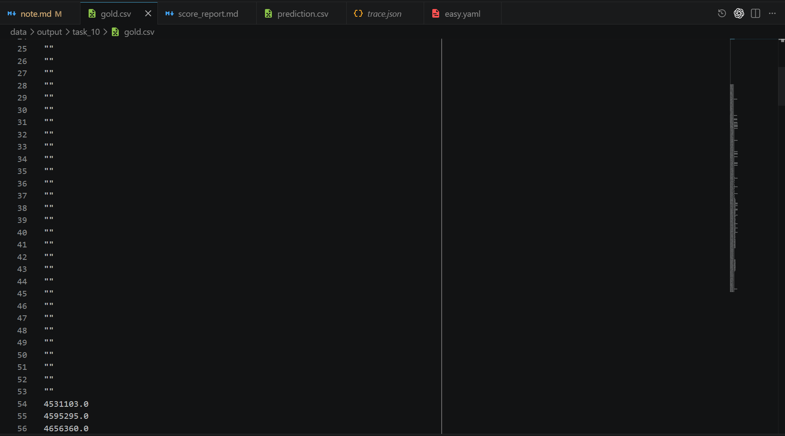
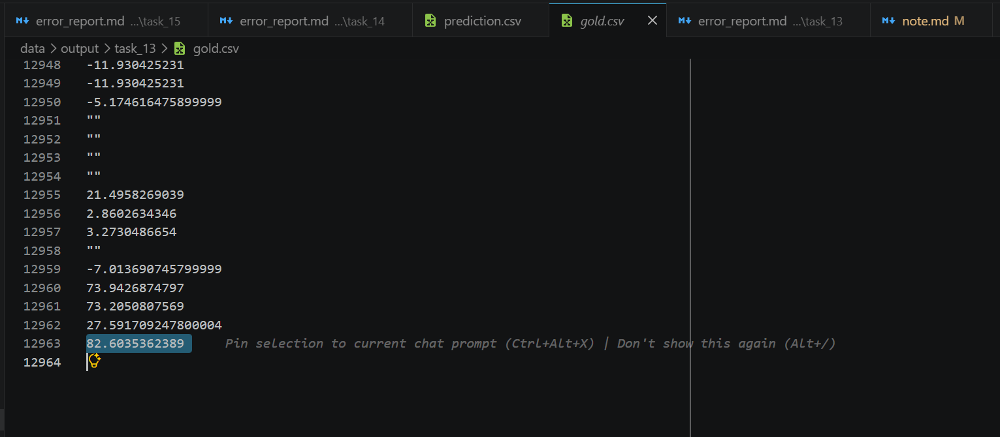

# 6月1日

phase2：

* 视频都是人机语音(中文/英文) + 一页一页的信息展示
  * 差分算法抽取稳定帧
* pdf都是纯文档
  * 感觉直接转md即可
* 每个任务只有一个视频
* 数据量大大增加，无论是表数据还是doc文档数量

get_distinct_value工具必须重构。改为实际执行

# 6月2

当前上下文过大，主要原因，表太多，关系太乱，引入太多无用信息(已经优化)

## 📈 Token 组成概览表

| 组成部分                                     | 字符数/数量     | 实际 Token 数     | 占总 Token 比例   | 说明                                                                                                 |
| :------------------------------------------- | :-------------- | :---------------- | :---------------- | :--------------------------------------------------------------------------------------------------- |
| **数据画像 (`Global Data Profile`)** | 373,391 字符    | **114,268** | **87.19%**  | 数据库所有表的 Schema、字段类型、非重复值 Top N、极值及 Join 关系等。                                |
| **视频稳定帧图片 (13张图像)**          | 13 张 JPEG 图片 | **14,197**  | **10.83%**  | 视频预处理生成的 13 个稳定帧以 `image_url` 传入多模态模型，平均每张图消耗 **1,092** Tokens。 |
| **系统提示词 (`System Prompt`)**     | 9,137 字符      | **1,869**   | **1.43%**   | Agent 运行的全局 System Instruction、工具使用规则等。                                                |
| **视频预处理上下文文本**               | -               | **576**     | **0.44%**   | 指明 timeline.md 及各稳定帧文件路径的辅助文本说明。                                                  |
| **用户问题 (`User Query`)**          | -               | **33**      | **0.03%**   | 用户的原始提问文本（含包裹标签）。                                                                   |
| **其它引导词 & Action Trigger**        | -               | **118**     | **0.08%**   | 上下文注入的前言 Preamble (59) 和提示首步操作的 Action Trigger (35) 等。                             |
| **协议与聊天模板开销 (Chat Overhead)** | -               | **~100**    | **0.08%**   | 消息格式包裹符及多模态序列化封装等额外消耗。                                                         |
| **总计**                               | -               | **131,061** | **100.00%** | **第一次 LLM 请求的全部 Input Tokens**                                                         |

图片建议也改为渐进式读取，不全部一次性注入上下文了

## task_3

**它在找不到 `mf_fmscaleanalysisn` 后，误把 `mf_fmretscaleanalysis.TotalAUM` 当作 `totalfundnv`，并且把同一基金经理在不同时间周期下重复出现的 TotalAUM 进行了 SUM，导致管理规模被严重放大，最终把大量不该进入“超过100亿”范围的基金经理也统计进来了。**

## task_4(已解决)

由于关闭了过程校验agent，在提交答案时，ai已经查出了137行答案，在提交时又只提交了64行答案。

其中中断的地方如下：

```json
              [
                "国家股",
                20141399.999999996
              ],
              [
                "大连冰山集团有限公司",
                19277999.999999996
              ],
```

暂时的推测：

```markdown
2. 大模型在生成长 JSON 时的“脑抽”（数值幻觉）
大模型在逐行生成这 137 行数据的过程中，其内部推理机制发生了混乱：

随着它生成的数据越来越多，它的上下文注意力（Attention）开始退化。
当它生成到第 64 行 ["国家股", 20141400.0] 时，它看到了下一行是 ["大连冰山集团有限公司", 19277999.9...]。
此时大模型产生了数值幻觉：它将原本的阈值两百万（2,000,000）错误记忆/理解为了两千万（20,000,000），并心想：“19,277,999 小于两千万，不符合两千万的披露标准，后面的数据都不要了。”
于是大模型主动截断了生成，自己闭合了 JSON 的括号 ] 和 }，导致后半段数据被它自己“自作聪明”地过滤掉了。
```

## task_6(已解决)

bug1(已修复)：

在 **Step 2** 和 **Step 3** 中，Agent 尝试使用 `read_doc` 工具读取 `video/briefing_timeline.md`，但读出来的转写内容由于编码格式转换问题呈现为严重的莫吉巴克乱码。例如：

* 原始语音中的 *“好 今天主管 让我把这个年度批次的定增项目整理一下”* 在文档读取结果中显示为了：`濂 浠婂ぉ涓荤 璁撴垜鎶婇欏嬪勾搴︽壒娆＄殑瀹氬為爡鐩鏁寸悊涓涓`
* *“近12个月 这个口径不对”* 显示为了：`杩12鍊嬫湀 閫欏嬪彛寰戜笉灏`

该 Agent  **未能识别并尝试修复这些乱码** （例如利用 UTF-8 和 GBK 重新转换解码），导致其完全失去了从语音中获取“要切到自然年度批次，且近12个月中混入了上一年度记录”这一关键逻辑提示的机会。

bug2:

模型过于自信，没有去查看转录的视频的音频文件，被图片数据误导。

## task_8

编码问题。(已修复)

官方答案是公司简称，而模型回答公司全称。

* 这种时候可能还是得考虑都回答，不能把答案列数限制的太死。

## task_10（已解决）



前53行是空行。

错误原因：

1. **Step 1（局限的初步查询）** ： Agent 首先尝试探索数据，它运行了以下 SQL 查询前 20 条记录：

   由于 1993–1997 年的数据在数据库中原本就为 `NULL`，这次查询返回了 20 条 `TotalAssets` 均为 `None` 的记录。
2. **Step 3 & Step 5（已经发现了正确的数据范围）** ：

* 随后 Agent 意识到前 20 条全为空，于是查询了非空总数与最值：

  它得到了正确反馈：共有 242 条非空记录，数值在 4,531,103 至 40,622,900 万元之间。
* 接着它还查询了最新的 10 条有效数据，发现最新数据在 2022 年 2 月。

1. **Step 7（致命逻辑错误 - 答案提交）** ： 在最后提交答案（调用 `answer` 函数）时，Agent  **没有重新编写 SQL 去拉取数据库中完整的 294 条记录** ，而是犯了严重的糊涂， **直接套用了第一步（Step 1）获取的局部结果** 。 它提交的 `rows` 参数为：

   这正是第一步中 `LIMIT 20` 查出来的 20 条空记录。

## task_13(已解决)



官方答案13000行。。。

感觉不能让LLM输出这么长的答案。考虑修改为最终答案直接使用工具调用返回的数据，不再让模型每次自己输出一遍答案。这样还能解决task_4的问题。

## task_14

官方答案为公司简称，模型回答了公司全称。

* 可以在提示词中约束

## task_15

比较难的一类题，需要从md文档中通过正则表达式召回数据。模型只成功召回了一半。这种题暂时不知道如何解决。

# 6月4

ws给的优化思路：

* 视频完全转化为文档(已实现)。
  * 我给出的：让一个agent专门看图片和语音文件，把所有信息转化为文档。
* 数据分析不能全放入上下文了，针对多表的情况，有个思路是：分析完 join关系后，能不能直接连一下，然后形成一个view ，这样agent就不用再join。(已添加)

# 6月6(已实现)

一个优化思路：(已实现)

提交答案修改为直接把工具的结果作为提交答案。同时答案校验节点可以看到SQL语句，或者python 代码。这样答案校验节点可以检验更多东西。增强了答案校验节点。

同时要求主agent提交答案的工具调用时，尽量写一个完整的SQL。

优点：

* 答案校验节点看到信息更多
* 主agent不再需要自己抄写一遍答案
* 适合一些答案很长的题可以

task_53,答案对但是格式不对

# 6月8号（已修复）

中文题目现在程序无法正确推断外键关系。中英文题目外键推断困难。(已修复)

# 6月10号

暂时先这样吧。虽然没有更好，但是也没有更坏。还是先分析分析错题。看看剩下的题为什么做不对。在此基础上继续优化。

# 6月13号

答案校验器增强校验 NULL， 去重，limit等。

过程校验强约束agent的善意推断，或表走偏。

对比加入video_agent的效果，复测那几个波动的题是video导致的原因还是，正常波动。

# 6月14号

文档结构化数据，我们一直没招的题，后续测试可以先排除：

- task_15
- task_31
- task_32
- task_37
- task_38

想到一个优化方向：让一个前置agent，帮忙先摘要出回答问题需要的表和文档。给LLM优先看这些资产。

v3：0.24分

# 6月16号

可以试试通过没有数字的行把文档分片，然后建立不同的表。

下次提交：移除自动join试试。视频agent可以保留。

# 6月17号(上)

针对文档的工作流，我希望规范化为以下步骤请你进行评估给出建议：

1. 数据行都有数字，我们根据没有数字的行，把这些自然语言描述的文档分界抽取出来，并且带上行号。我们把这个功能制作为一个工具。可以让主agent调用并看到文档结构。
2. 主agent可以调用extract_structured_doc，按照之前的文档分块，去抽取指定块的信息。比如主agent输入数组，然后工具就抽取指定块之间的行。

下一步修改：一个块至少20条记录。减少调用次数，加快速度。

我评估了 `artifacts/runs/manual_structured_doc_tool_test/task_3/doc_structure/mf_fmscaleanalysisn.json`：

分块结果现在是好的。它识别出 18 个 block，`boundary_reason` 只有 `markdown_heading` 和 `no_digit_text`，之前那种 `接下来，档案 44...` / `继续审查档案 275...` / `最后，档案 268...` 的数据行已经没有混入 `boundary_text`。对 task_3 来说，理想选择是：

`B001/B002`: 身份段，`candidate_fields=["personalcode"]`
`B003/B004`: 总规模段，`candidate_fields=["totalfundnv"]`
后面的权益、混合、债券、货币、QDII、其他类型段都不应该参与 `totalfundnv` 抽取。

我也修改了真实测试脚本 [scripts/manual_structured_doc_tool_test.py](/c:/Users/ulna/Desktop/kddcup/kddcup2026-data-agents-starter-kit/scripts/manual_structured_doc_tool_test.py)：默认字段改成 `personalcode,totalfundnv`，自动只选相关 blocks；查询也改成动态字段，并对 `totalfundnv` 做安全数值提取，避免 `"182.488480 亿元"` 这种字符串导致 SQL 失败。脚本语法校验通过：`uv run python -m py_compile scripts\manual_structured_doc_tool_test.py`。

真实抽取测试结果不理想，但问题已经很清楚：结构分块没问题，失败发生在 `extract_structured_doc` 的 entity merge。实际产物在 `artifacts/runs/manual_structured_doc_tool_test_task3_scale/task_3/structured_doc/mf_fmscaleanalysisn.jsonl`：

- 抽取出 `100` 行
- `50` 行只有 `personalcode`
- `50` 行只有 `totalfundnv`
- `0` 行同时有 `personalcode + totalfundnv`

根因是 LLM 在 extraction plan 里选择了 `entity_key_fields=["personalcode"]`，但总规模段原文只有“档案号”，没有 PersonalCode，所以总规模 fact 没法和身份 fact 合并。下一步真正要修的是：`extract_structured_doc` 的 plan/merge 必须优先使用跨 block 都稳定出现的实体键，比如这里的 `archive_id/档案号`，而不是用目标输出字段 `personalcode` 当 merge key。

# 6月17号(下)

下一步：使用这个工具去挨个测试这些长文档题目
artifacts\runs\20260617T125537Z 为什么抽取失败了？

# 6月18

1. 没有传字段时，只抓取有效的块√
2. 调度算法 √
3. 调度算法的一个问题，排队挂起的时候，不应该计入timeout时间。√

## task_31

单位不统一。

## task_5

答案校验节点需要更新(暂时先把答案校验节点重试次数降为1，解决问题)

## task_15

文档不同块提取单位不一样。试试plan模式给每个字段指定一个统一单位。单位问题也要结合答案来看，看看答案都是什么单位。

# 6月19

提取的所有md文档中，应该强制提取主键。√

task_31提取信息格式不是很对

我希望进行一个修改，在extract_structured_doc在这个工具中调用的LLM时，把temp等参数，我们设置一个可以让模型比较稳定输出的参数。而不是活跃度。√

根因：Step 4 生成的 field_hint 太宽泛

# 6月20
